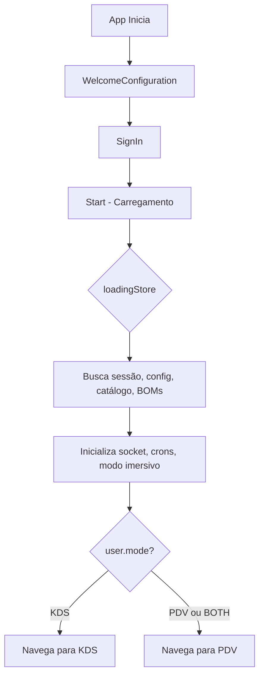
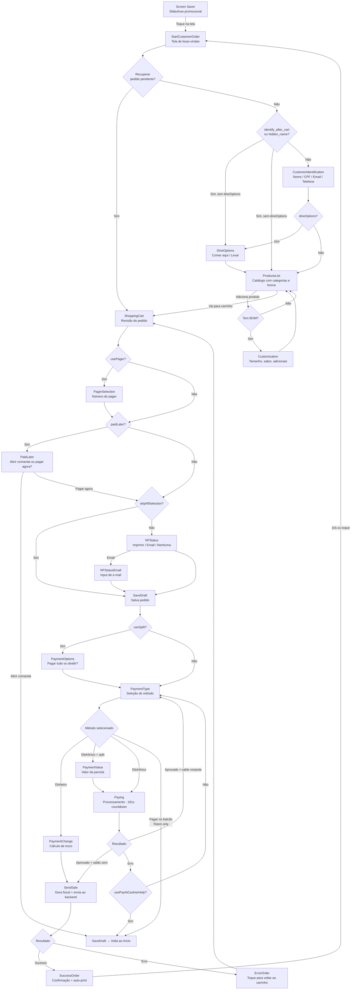
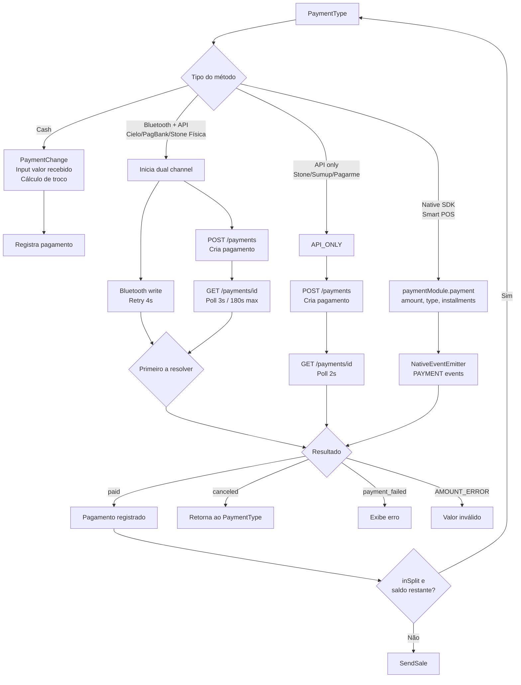
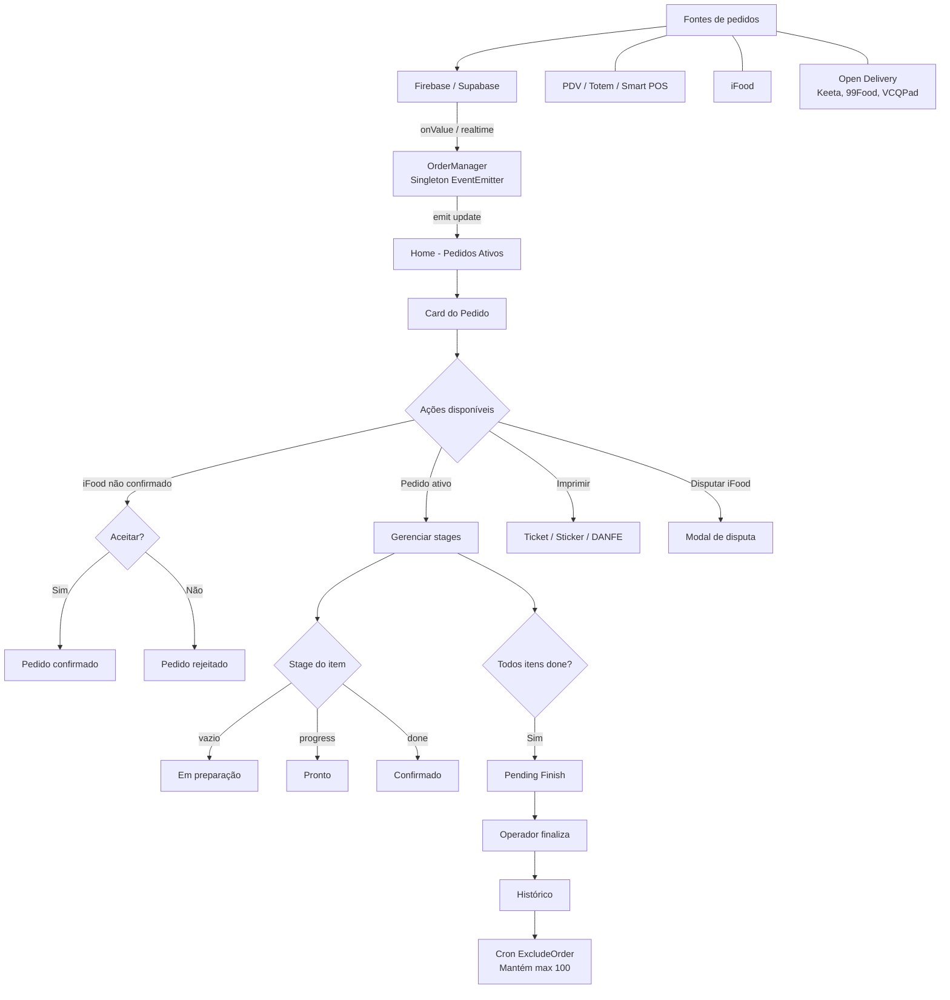
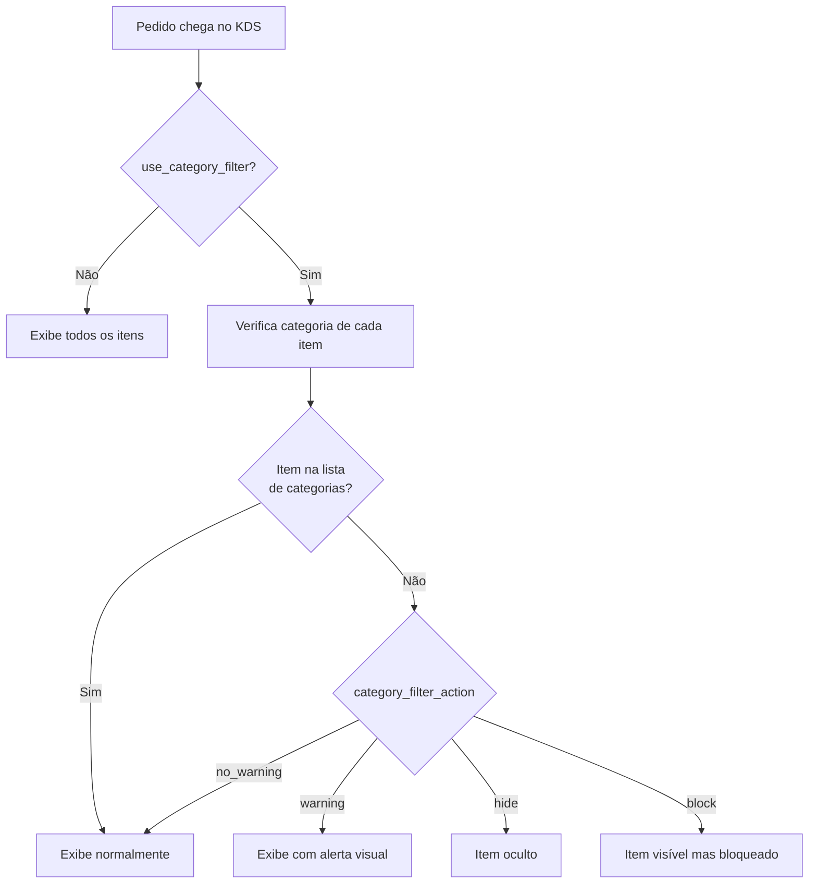
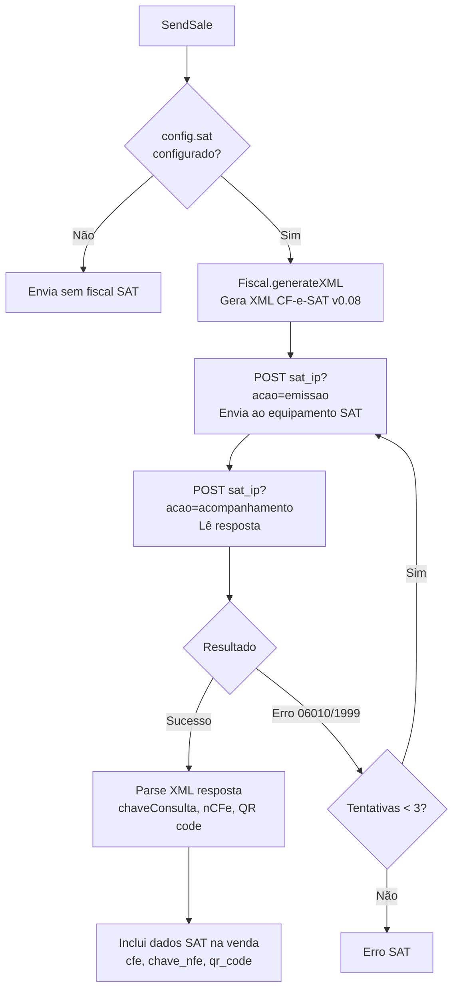
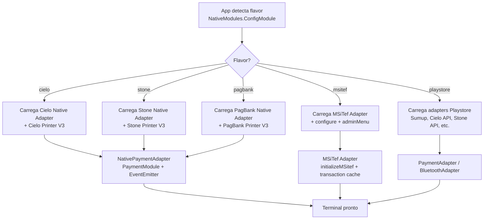

# Fluxos — Diagramas

> Diagramas Mermaid dos fluxos principais de cada modo.

## Fluxo de Inicialização do App

## Fluxo Completo — PDV / Totem / Smart POS

## Fluxo de Pagamento Detalhado

## Fluxo KDS — Ciclo de Vida do Pedido

## Fluxo KDS — Filtro de Categorias

## Fluxo SAT / CF-e (Independente do Modo)

## Fluxo de Inicialização do Smart POS

