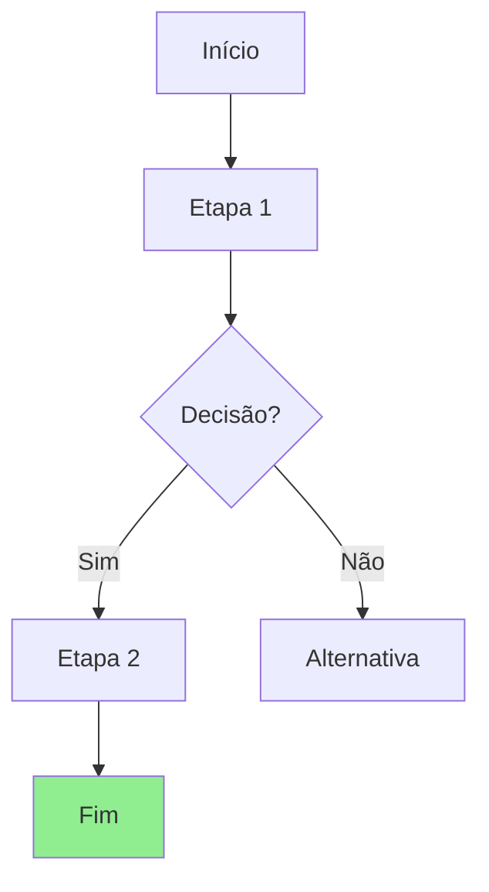
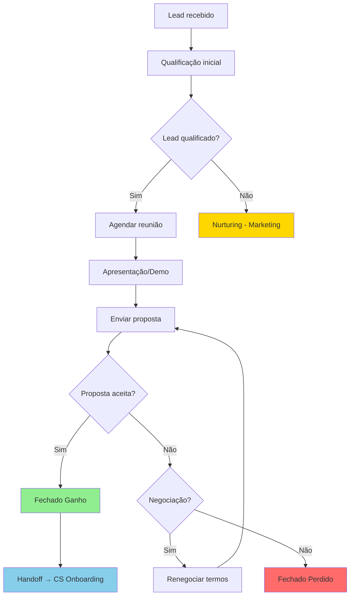

# Gerar Fluxogramas Mermaid

Criar fluxogramas detalhados do workflow principal de cada departamento
usando sintaxe Mermaid, incluindo decision points, handoffs e automações.

## Process

1. Para cada departamento, identificar o processo principal
2. Mapear as etapas do processo como nós do fluxograma
3. Adicionar decision points (gates) como losangos
4. Marcar handoffs cross-department com cor/estilo diferente
5. Indicar onde automações serão aplicadas
6. Apresentar ao usuário e iterar se necessário

## Output Format

## Output Example

## Quality Criteria

- [ ] Cada departamento tem pelo menos 1 fluxograma do processo principal
- [ ] Decision points representados como losangos
- [ ] Handoffs cross-department indicados visualmente
- [ ] Sintaxe Mermaid válida

## Veto Conditions

1. Fluxograma com menos de 5 nós (oversimplificado)
2. Sintaxe Mermaid inválida
