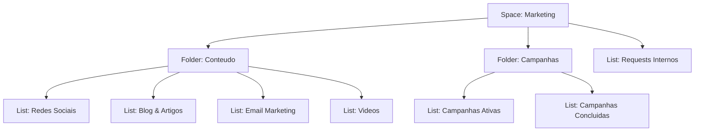
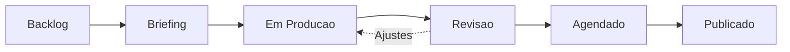
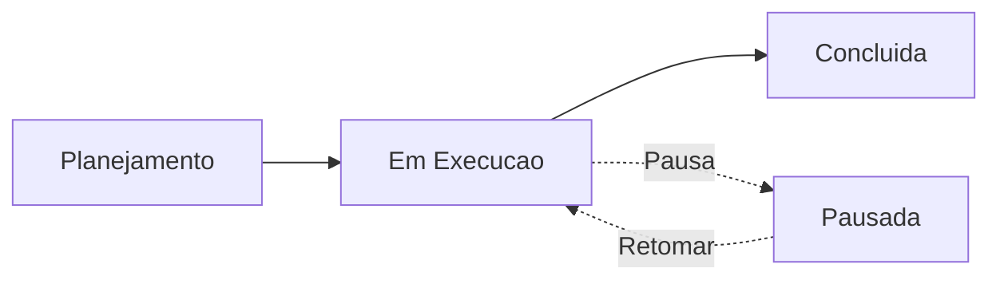
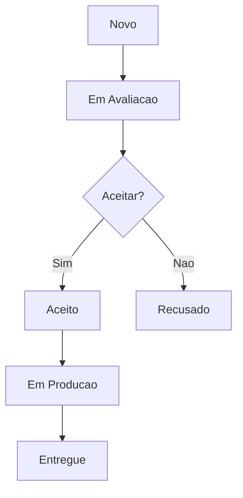

# Guia de Uso ClickUp — Nexuz Marketing

## Visao Geral

Este guia cobre a configuracao do departamento de **Marketing** no ClickUp da Nexuz.
O workspace foi configurado com nivel **Minimo** (hierarquia + statuses customizados).

### Hierarquia do Workspace

### URLs de Acesso Rapido

| Recurso | Link |
|---|---|
| Space Marketing | https://app.clickup.com/3086998/v/s/90174933917/1 |
| Redes Sociais | https://app.clickup.com/3086998/v/l/li/901712369683 |
| Blog & Artigos | https://app.clickup.com/3086998/v/l/li/901712369684 |
| Email Marketing | https://app.clickup.com/3086998/v/l/li/901712369685 |
| Videos | https://app.clickup.com/3086998/v/l/li/901712369686 |
| Campanhas Ativas | https://app.clickup.com/3086998/v/l/li/901712369687 |
| Campanhas Concluidas | https://app.clickup.com/3086998/v/l/li/901712369688 |
| Requests Internos | https://app.clickup.com/3086998/v/l/li/901712369689 |

---

## Departamento: Marketing

### Como Usar no Dia a Dia

#### Criar uma nova peca de conteudo

1. Acesse o Space **Marketing** > Folder **Conteudo**
2. Escolha a List correta:
   - **Redes Sociais** — posts, stories, reels (Instagram, LinkedIn, YouTube, TikTok)
   - **Blog & Artigos** — artigos de blog, cases de sucesso, conteudo SEO
   - **Email Marketing** — newsletters, automacoes de email, campanhas de nurturing
   - **Videos** — videos tutoriais, cases, conteudo para YouTube e Reels
3. Clique em **"+ Adicionar Tarefa"**
4. Preencha: Titulo descritivo, Descricao com briefing, Data de vencimento
5. A tarefa inicia automaticamente no status **Backlog**

#### Mover uma peca pelo fluxo de producao

1. **Backlog** — Ideia registrada, aguardando priorizacao
2. **Briefing** — Definindo escopo, referencias e formato
3. **Em Producao** — Texto/design/video sendo criado
4. **Revisao** — Peca pronta para revisao interna
5. **Agendado** — Aprovado, agendado para publicacao
6. **Publicado** — Publicado! Tarefa concluida

**Como mover:** Clique no status da tarefa e selecione o proximo, ou arraste o card no Board View.

#### Criar uma nova campanha

1. Acesse **Marketing** > Folder **Campanhas** > List **Campanhas Ativas**
2. Clique em **"+ Adicionar Tarefa"**
3. Preencha: Nome da campanha, Descricao com objetivo, Datas de inicio e fim
4. Use subtasks para cada peca/acao da campanha
5. Mova pelo fluxo: **Planejamento** > **Em Execucao** > **Concluida**

#### Receber um pedido de outro departamento

1. O solicitante cria uma tarefa em **Requests Internos**
2. Voce avalia e muda o status:
   - **Em Avaliacao** — analisando viabilidade
   - **Aceito** — vamos produzir
   - **Recusado** — nao podemos atender agora
3. Se aceito, mova para **Em Producao** e depois **Entregue**

---

### Quick Reference

| Acao | Como Fazer |
|---|---|
| Novo post para redes sociais | + Adicionar Tarefa em Conteudo > Redes Sociais |
| Novo artigo de blog | + Adicionar Tarefa em Conteudo > Blog & Artigos |
| Nova newsletter | + Adicionar Tarefa em Conteudo > Email Marketing |
| Novo video | + Adicionar Tarefa em Conteudo > Videos |
| Nova campanha | + Adicionar Tarefa em Campanhas > Campanhas Ativas |
| Mover tarefa de status | Clicar no status > selecionar proximo |
| Ver calendario de publicacoes | Board View no Folder Conteudo |
| Ver todas as tarefas de Marketing | Clicar no Space Marketing |
| Filtrar minhas tarefas | Botao "Modo eu" na barra de ferramentas |
| Arquivar campanha concluida | Mover tarefa para List "Campanhas Concluidas" |

---

### Automacoes Ativas

| O que acontece | Quando |
|---|---|
| (Nenhuma automacao configurada) | Nivel Minimo — automacoes serao adicionadas na fase 2 |

**Recomendacoes para fase 2:**
- Notificacao ao mover para "Revisao" — avisa o revisor
- Auto-assign ao criar tarefa — atribui ao responsavel padrao
- Mover para "Campanhas Concluidas" — ao marcar campanha como "Concluida"

---

### FAQ

**P: Onde registro uma ideia de conteudo que ainda nao tem data?**
R: Crie a tarefa na List apropriada (Redes Sociais, Blog, etc.) e deixe no status **Backlog** sem data de vencimento. Quando for priorizada, adicione a data e mova para **Briefing**.

**P: Como vejo tudo que esta agendado para publicacao esta semana?**
R: Use o **Board View** no Folder Conteudo e filtre pelo status **Agendado**. Na fase 2, teremos um Calendar View para visualizacao por data.

**P: Outro departamento precisa de um material — como solicitar?**
R: O solicitante deve criar uma tarefa na List **Requests Internos** com titulo claro, descricao do que precisa e data limite. O time de Marketing avalia e responde.

**P: Como diferencio conteudo por plataforma (Instagram vs LinkedIn)?**
R: Por enquanto, inclua a plataforma no titulo ou descricao da tarefa (ex: "[Instagram] Post sobre lancamento X"). Na fase 2, adicionaremos um Custom Field "Plataforma" para filtros mais faceis.

**P: Uma campanha foi pausada, como registro isso?**
R: Mova a tarefa para o status **Pausada** em Campanhas Ativas. Quando retomar, mova de volta para **Em Execucao**.

**P: Como movo uma campanha para o arquivo de concluidas?**
R: Quando a campanha terminar, mude o status para **Concluida**. Opcionalmente, mova a tarefa para a List **Campanhas Concluidas** para manter a List de Ativas limpa.

---

## Proximos Passos (Fase 2)

Apos o time se acostumar com a estrutura basica (2-4 semanas), recomendamos:

1. **Calendar View** no Folder Conteudo — calendario editorial visual
2. **Custom Fields** — Plataforma, Tipo de Conteudo, Responsavel de Revisao
3. **Automacoes basicas** — notificacoes e auto-assign
4. **Dashboards** — metricas de producao (tarefas por status, velocidade, etc.)
5. **Permissoes** — controlar quem ve/edita o que no Space Marketing

---

*Documento gerado automaticamente pelo squad nxz-clickup-setup em 2026-03-27.*
*Auditor: Rui Revisao | Trainer: Tiago Treinamento*
