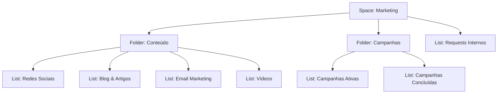
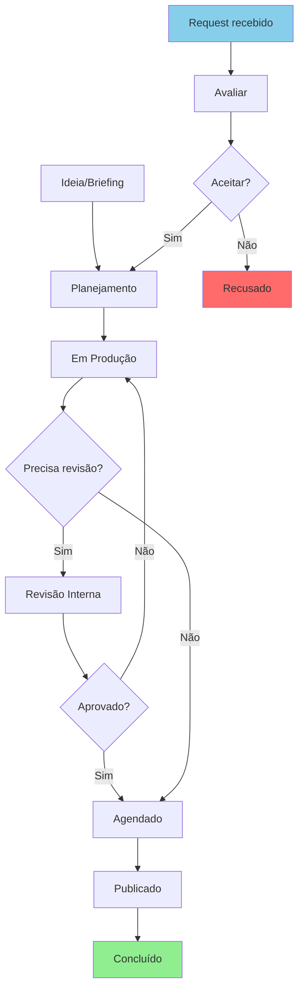

# Design do Workspace ClickUp — Nexuz

## Visão Geral

| Item | Detalhe |
|---|---|
| **Departamento** | Marketing |
| **Time** | 1-3 pessoas (multifuncional) |
| **Nível de Customização** | Mínimo — Hierarquia Spaces/Folders/Lists |
| **Data** | 2026-03-27 |

## Perfil do Departamento: Marketing

### Processos Mapeados
- **Produção de conteúdo**: Blog, redes sociais, email marketing, vídeos
- **Criativos/Design**: Criação de materiais visuais, vídeos, banners
- **Campanhas**: Campanhas pagas, lançamentos, promoções sazonais
- **Calendário editorial**: Planejamento e agendamento de publicações

### Dores Identificadas
- Sem visibilidade do status de cada peça/campanha
- Falta de planejamento — conteúdo feito sob demanda

### Handoffs Cross-Department
- **Marketing → Vendas**: Leads qualificados passados para o time comercial
- **Vendas → Marketing**: Pedidos de materiais de apoio comercial
- **Marketing → Dev**: Solicitações de landing pages, features no site

### Necessidades de Visibilidade
- Status das peças (o que está em produção, revisão, publicado)
- Calendário visual (tudo que vai ser publicado no mês)
- Carga do time (quem está fazendo o quê)
- Métricas de campanha (ROI, leads, conversão)

---

## Hierarquia Proposta

```
Workspace: Nexuz
└── Space: Marketing
    ├── Folder: Conteúdo
    │   ├── List: Redes Sociais
    │   ├── List: Blog & Artigos
    │   ├── List: Email Marketing
    │   └── List: Vídeos
    ├── Folder: Campanhas
    │   ├── List: Campanhas Ativas
    │   └── List: Campanhas Concluídas
    └── List: Requests Internos
```

### Rationale
- **Folder: Conteúdo** agrupa toda a produção por canal (4 Lists) — o calendário editorial é uma View (Calendar) sobre estas lists, não uma estrutura separada
- **Folder: Campanhas** separa campanhas ativas de concluídas — cada campanha pode ter tasks com subtasks por peça
- **List: Requests Internos** (direto no Space, sem Folder) — processo simples para pedidos de Vendas e Dev
- Criativos/Design ficam como tasks dentro das Lists de Conteúdo/Campanhas (não justifica Folder próprio para time de 1-3 pessoas)

### Diagrama da Hierarquia



---

## Fluxograma do Processo Principal



---

## Statuses por List

### Conteúdo (Redes Sociais, Blog & Artigos, Email Marketing, Vídeos)

| Status | Grupo | Cor |
|---|---|---|
| Backlog | Active | Cinza |
| Briefing | Active | Azul |
| Em Produção | Active | Amarelo |
| Revisão | Active | Laranja |
| Agendado | Active | Roxo |
| Publicado | Closed | Verde |

### Campanhas Ativas

| Status | Grupo | Cor |
|---|---|---|
| Planejamento | Active | Azul |
| Em Execução | Active | Amarelo |
| Pausada | Active | Cinza |
| Concluída | Closed | Verde |

### Requests Internos

| Status | Grupo | Cor |
|---|---|---|
| Novo | Active | Azul |
| Em Avaliação | Active | Amarelo |
| Aceito | Active | Verde claro |
| Em Produção | Active | Laranja |
| Entregue | Closed | Verde |
| Recusado | Closed | Vermelho |

---

## Views Recomendadas

| View | Tipo | Escopo | Uso Principal |
|---|---|---|---|
| Pipeline de Conteúdo | Board View | Folder: Conteúdo | Kanban por status — gestão diária |
| Calendário Editorial | Calendar View | Folder: Conteúdo | Visualizar publicações por data |
| Minhas Tarefas | List View | Space: Marketing | Filtrado por assignee = eu |
| Campanhas Board | Board View | Folder: Campanhas | Status de cada campanha |

**Nota:** Máximo 4 Views — suficiente para time de 1-3 pessoas sem poluir a interface.

---

## Decisões de Design

1. **Hierarquia simples** — 2 Folders + 1 List solta para time enxuto
2. **Sem Folder para Criativos** — criativos são tasks dentro de Conteúdo/Campanhas
3. **Sem OKRs nesta fase** — nível mínimo, pode ser adicionado depois
4. **Sem automações nesta fase** — nível mínimo, pode ser adicionado depois
5. **Calendar View substitui Folder de Calendário** — mais eficiente que estrutura separada
