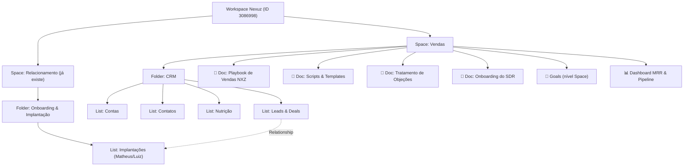
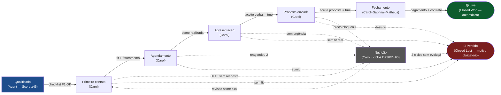
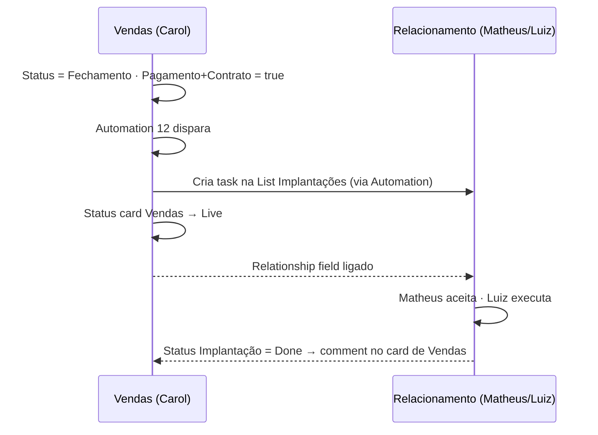

# Design do Workspace ClickUp — Vendas · Nexuz

**Run:** 2026-04-13-163931 · **Arquiteto:** Ernesto Estrutura 📐
**Base:** Funil NXZ v1.0 + pesquisa de Duda + decisões de checkpoint (Opção 3 com Docs).

---

## 1. Visão Geral da Hierarquia

### Rationale
- **Um Space único para Vendas:** permissionamento limpo, Carol e SDRs vivem aqui.
- **4 Lists em um Folder CRM:** tudo que é "objeto de negócio" (Lead, Conta, Contato, Nutrição) compartilha dependências e dashboards.
- **4 Docs no nível Space:** conhecimento vivo, buscável, linkável de qualquer card.
- **Handoff cross-space via Relationship Field:** o card do Deal no Vendas aponta para o card de Implantação no Space Relacionamento. Ownership explícito, sem poluição.

---

## 2. Fluxograma do Funil de Vendas

---

## 3. Hierarquia Detalhada

### Space: Vendas
- **Avatar/cor:** Laranja (alinhado à identidade NXZ)
- **Membros:** Carol (ops), SDRs, Walter (admin), Sabrina (guest financeiro — só cards em Fechamento)
- **Permissões:** Matheus/Luiz como guests apenas no card de Implantação relacionado

#### Folder: CRM
| List | Propósito | Statuses |
|---|---|---|
| **Leads & Deals** | Funil principal — 1 card = 1 oportunidade | 9 custom statuses do funil |
| **Contas** | Empresas (CNPJ, razão social, segmento) | Ativa / Prospect / Cliente / Churn |
| **Contatos** | Pessoas nas contas | Decisor / Influenciador / Usuário / Inativo |
| **Nutrição** | Leads em cadência longa | Ciclo 1 / Ciclo 2 / Revisão |

### Docs (nível Space)
| Doc | Sub-pages principais |
|---|---|
| 📘 **Playbook de Vendas NXZ** | Visão funil · ICP QS · ICP FS · Regras Lead Score · Política desconto · Matriz escalonamento |
| 📗 **Scripts & Templates** | Abertura LinkedIn QS · Abertura Email FS · Follow-ups D+2/D+5/D+8 · Roteiro Demo QS · Roteiro Demo FS · Proposta QS · Proposta FS · Emails nutrição |
| 📕 **Tratamento de Objeções** | "Está caro" · "Já usamos X" · "Vou pensar" · "Falta autorização" · "Não é prioridade" |
| 📙 **Onboarding do SDR** | Semana 1 produto+ICPs · Semana 2 shadowing · Semana 3 role-play · Semana 4 supervisionado |

---

## 4. Custom Statuses — List `Leads & Deals`

| # | Status | Tipo | Cor | Responsável default |
|---|---|---|---|---|
| 1 | Qualificado | Open | Azul | Agent (automação) |
| 2 | Primeiro contato | Active | Verde | Carol |
| 3 | Agendamento | Active | Verde | Carol |
| 4 | Apresentação | Active | Verde | Carol |
| 5 | Proposta enviada | Active | Amarelo | Carol |
| 6 | Fechamento | Active | Laranja | Carol |
| 7 | Live | **Closed (Won)** | Verde escuro | — (automático) |
| 8 | Nutrição | Active | Cinza | Carol |
| 9 | Perdido | **Closed (Lost)** | Vermelho | Carol |

---

## 5. Custom Fields — List `Leads & Deals`

| Campo | Tipo ClickUp | Observação |
|---|---|---|
| Lead Score | `Rating` (0-100 via Number alternativo) | Alimenta ordenação "Lista da semana" |
| Canal | `Dropdown` | Inbound · Outbound · Indicação · Evento · Parceiro |
| Reason to Call | `Label` (multi) | Gatilhos de intenção detectados |
| Abertura sugerida | `Text long` | Preenchido pelo Agent |
| LinkedIn URL | `URL` | |
| ICP | `Dropdown` | QS · FS |
| Produto de interesse | `Label` (multi) | NXZ ERP · NXZ Go · NXZ KDS · NXZ Delivery |
| Faturamento estimado | `Money` (BRL) | |
| Decisores | `People` (multi) + `Text` | People para internos, Text para externos |
| Nº decisores | `Number` | |
| Data demo | `Date` (com hora) | Alimenta Calendar view |
| Tipo demo | `Dropdown` | QS (15-20min) · FS (45-60min) |
| Dor central | `Text long` | |
| Aceite verbal | `Checkbox` | Gate para enviar proposta |
| Data proposta enviada | `Date` | |
| Valor proposto | `Money` (BRL) | |
| Aceite proposta | `Checkbox` | Gate para Fechamento |
| Probabilidade | `Number` (%) | |
| Forecast ponderado | `Formula` | `field("Valor proposto") * field("Probabilidade") / 100` |
| MRR | `Money` (BRL) | Soma em Dashboard |
| Módulos contratados | `Label` (multi) | |
| — Fechamento — | | |
| CNPJ | `Text` | |
| Razão social | `Text` | |
| Boleto emitido | `Checkbox` | |
| Pagamento confirmado | `Checkbox` | Gate para Live |
| Contrato assinado | `Checkbox` | Gate para Live |
| — Nutrição/Perdido — | | |
| Motivo nutrição | `Dropdown` | Sem urgência · Sem orçamento · "Vou pensar" · Sem resposta · Reagendou 2x · Preço bloqueou |
| Ciclo nutrição | `Dropdown` | 1 · 2 |
| Próxima revisão | `Date` | Trigger scheduled |
| Motivo perda | `Dropdown` | Preço · Sem fit · Sem urgência · Sem resposta · Outro |
| Etapa perdida | `Dropdown` | Reflete o status anterior |
| — Relacionamento — | | |
| Conta | `Relationship` → List Contas | |
| Contatos ligados | `Relationship` → List Contatos | |
| Implantação | `Relationship` → Space Relacionamento / List Implantações | Handoff cross-space |

---

## 6. Automações (17 do Funil NXZ mapeadas)

**Política de alertas:** alertas internos = notificação nativa ClickUp (Post comment com `@mention` ou Action "Notify"). Email só para comunicação com o LEAD (externo).

| # | Trigger ClickUp | Ação | Canal |
|---|---|---|---|
| 1 | Qualificado AND time-in-status > 48h | Post comment `@Carol` | Notif |
| 2 | Primeiro contato AND time-in-status > 16d | Post comment `@Carol` ("mova para Nutrição ou Perdido") | Notif |
| 3 | Status changes to Agendamento | Send email template "Confirmação demo" ao lead | Email ClickApp |
| 4 | Data demo = amanhã (scheduled) | Send email lembrete ao lead + Notify `@Carol` | Email + Notif |
| 5 | Apresentação AND time-in-status > 48h | Post comment `@Carol` | Notif |
| 6 | Proposta enviada AND time-in-status > 3d | Send email follow-up ao lead | Email ClickApp |
| 7 | Proposta enviada AND time-in-status > 7d | Post comment `@Carol` | Notif |
| 8 | Fechamento AND CNPJ empty AND 48h | Post comment `@Carol` (cobrar docs) | Notif |
| 9 | Boleto emitido = true AND 5d AND Pagamento = false | Post comment `@Carol` + `@Sabrina` | Notif |
| 10 | Pagamento = true AND Contrato = false AND 3d | Post comment `@Carol` | Notif |
| 11 | Pagamento + Contrato = true | Change status → Live + Post comment `@Luiz` + Create task em List Implantações | Notif + Ação |
| 12 | Status changes to Perdido AND Motivo perda empty | Post comment `@Carol` (bloqueante visual) | Notif |
| 13 | Nutrição AND time-in-status = 7d | Send email "Conteúdo NXZ" ao lead | Email ClickApp |
| 14 | Nutrição AND time-in-status = 15d | Send email "Case NXZ" ao lead | Email ClickApp |
| 15 | Nutrição AND time-in-status = 30d | Post comment `@Carol` (revisar score) | Notif |
| 16 | Próxima revisão = hoje (scheduled) | Post comment `@Carol` | Notif |

**Balanço:** 11 notificações nativas + 5 emails (todos ao lead externo). Total **16 automações** (Jason removido — escopo de onboarding/implantação).

> **Nota técnica:** triggers baseados em "time in status" no ClickUp exigem combo scheduled + condition (descoberto no Run 1). Algumas requerem plano Business+.
> **Guest users:** se Sabrina/Matheus forem *guests* com acesso limitado, validar no Step 06 se a notificação ClickUp chega — caso contrário, adicionar fallback via email nessas 2 automações específicas.

---

## 7. Views — List `Leads & Deals`

| View | Tipo | Filtros | Dono | Cadência |
|---|---|---|---|---|
| **Pipeline** | Board | Exclui Live + Perdido | Carol | Diária |
| **Lista da semana** | List | Status = Qualificado · sort Lead Score desc | Carol | Segunda |
| **Demos desta semana** | Calendar | Data demo ∈ semana atual | Carol | Quinta |
| **Revisão Nutrição** | List | Status = Nutrição · Próxima revisão ≤ hoje+7 | Carol | Sexta |
| **Forecast** | List agrupada por Status | exclui Perdido | Carol + Walter | Semanal |
| **Leads perdidos** | List agrupada por Motivo perda | Status = Perdido | Walter | Mensal |

### Dashboard: "MRR & Pipeline NXZ"
Cards:
1. Soma de `MRR` onde Status = Live · período mês corrente
2. Soma de `Forecast ponderado` (pipeline ativo)
3. Calculation: count(Live) / count(Live + Perdido) · mês → Win Rate
4. Pie chart: Leads por Canal (mês)
5. Bar chart: Leads perdidos por Motivo (trimestre)
6. Line: MRR adicionado por semana (trailing 12w)

---

## 8. OKRs Sugeridos

**Objective:** Estabelecer previsibilidade comercial no trimestre Q2-2026

- **KR1:** MRR adicionado ≥ R$ 50.000/mês (soma de MRR onde Status = Live)
- **KR2:** Win Rate ≥ 25% (Live ÷ [Live + Perdido])
- **KR3:** Ciclo médio de venda ≤ 21 dias (Qualificado → Live ou Perdido)
- **KR4:** 90% dos Perdidos com motivo preenchido (qualidade do aprendizado)
- **KR5:** ≥ 40 demos realizadas/mês

---

## 9. Cross-Department Handoff

---

## 10. Anti-Patterns evitados

- ❌ Folder com 1 List só (evitado — Docs absorvem conhecimento avulso)
- ❌ Onboarding/Implantação no Space Vendas (evitado — handoff cross-space)
- ❌ Custom statuses excessivos (mantido 9 = espelho exato do funil)
- ❌ Custom Fields redundantes (Decisores = People+Text consolida)
- ❌ Automations genéricas (todas têm trigger+action concretos)

---

## 11. Plano de Execução (Step 06)

Ordem de criação via MCP ClickUp / API v2 / Playwright:

1. Space "Vendas" (Playwright — MCP não suporta)
2. Folder "CRM" (API v2)
3. Lists: Leads & Deals, Contas, Contatos, Nutrição (API v2)
4. Custom Statuses em Leads & Deals (Playwright — API v2 não suporta)
5. Custom Fields (API v2)
6. Views (Playwright ou API)
7. Automations (Playwright — UI)
8. Docs + sub-pages (MCP suporta)
9. Relationship field → Space Relacionamento/List Implantações
10. Dashboard (Playwright)
11. Goals (Playwright)
