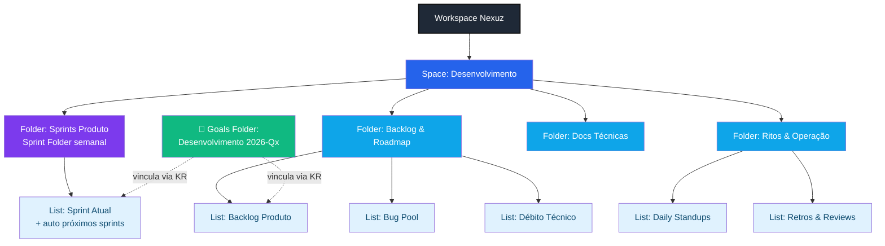

# Design do Workspace ClickUp — Desenvolvimento / Produtos (Nexuz)

_Arquiteto: Ernesto Estrutura 📐 · Data: 2026-04-14 · Run: 2026-04-14-212411_

---

## 1. Visão Geral da Hierarquia



**Rationale:**
- Space único por agilidade. Um Space = uma área ("Desenvolvimento" engloba Produtos).
- **Sprint Folder nativo** (`Sprints Produto`) para cadência semanal automática.
- Backlog dividido por **natureza** (Produto / Bugs / Débito) — alimenta o split 20/80 via custom field Tipo.
- Ritos separados para não poluir o backlog principal (Daily, Retros).
- Goals ficam no módulo Goals nativo (hierarquia paralela), vinculados via Relationship "KR vinculada".

---

## 2. Fluxograma — ciclo de vida da tarefa e sprint

```mermaid
flowchart LR
  subgraph SOURCE[Origem]
    A1[Ideia / Feedback]
    A2[Bug reportado]
    A3[Débito técnico]
  end

  SOURCE --> TRIAGE{Triagem:<br/>Tipo + Prioridade + KR}
  TRIAGE -->|Feature/Inovação| BKLG[List: Backlog Produto]
  TRIAGE -->|Bug| BUGS[List: Bug Pool]
  TRIAGE -->|Débito Técnico| TECH[List: Débito Técnico]

  BKLG --> REFINE[Refinamento:<br/>Descrição MD, Story Point, AC]
  BUGS --> REFINE
  TECH --> REFINE

  REFINE --> PLAN{{Sprint Planning semanal<br/>20% bugs · 80% feature/inov<br/>+ tasks >90d forçadas}}

  PLAN --> SPR[Sprint Atual]
  SPR --> S1[Backlog]
  S1 --> S2[To Do]
  S2 --> S3[In Progress]
  S3 --> S4[In Review<br/>PR GitHub/GitLab aberto]
  S4 --> S5[QA]
  S5 --> S6[Done]

  S3 -.comment diário.-> DAILY[List: Daily Standups]
  S4 -.notifica líder.-> LEAD[👤 Líder]

  S6 -->|rollover auto se Incompleta| NEXT[Próxima Sprint]
```



---

## 3. Hierarquia detalhada

### Space: **Desenvolvimento**
- **Owner:** Líder de Produto/Dev (Walter)
- **Privacy:** Private (equipe de Dev + stakeholders)
- **ClickApps ativas:** Sprints, Story Points, Time Tracking, Dependencies, Priorities, Tags, Custom Fields, Multiple Assignees
- **Integrações Space-level:** GitHub (repos da Nexuz), GitLab

### Folders e Lists

#### 📁 Folder: `Sprints Produto` (Sprint Folder nativo)
Configurações:
- Duration: **1 week**
- Start day: **Segunda-feira**
- Automatically start next Sprint: ✅
- Move unfinished tasks to next Sprint: ✅ (rollover)
- Naming: `Sprint {start-date} → {end-date}` (auto)

**List: `Sprint Atual`**
- É a sprint ativa; ClickUp cria automaticamente as próximas conforme cadência.
- Herda statuses do Folder.

#### 📁 Folder: `Backlog & Roadmap`
Herda statuses simplificados (Backlog → Refinada → Priorizada → Em Sprint → Done).

- **List: `Backlog Produto`** — features e inovações
- **List: `Bug Pool`** — bugs triados aguardando sprint
- **List: `Débito Técnico`** — items de refactor/infra

#### 📁 Folder: `Ritos & Operação`
Herda statuses simples (Aberto → Em andamento → Concluído).

- **List: `Daily Standups`** — uma task por membro por dia (template)
- **List: `Retros & Reviews`** — retrospectivas e reviews de sprint

#### 📁 Folder: `Docs Técnicas`
- **List: `ADRs & RFCs`** — Architecture Decision Records (task como doc)

---

## 4. Custom Statuses (por Folder)

### Folder `Sprints Produto` + `Sprint Atual`
| Status | Cor | Descrição |
|---|---|---|
| Backlog | cinza | Na sprint mas ainda não iniciada |
| To Do | azul | Pronta para começar (dependencies resolvidas) |
| In Progress | amarelo | Em execução; branch criada |
| In Review | laranja | PR/MR aberto · notifica líder |
| QA | roxo | Deploy em staging / validação |
| Done | verde | Mergeada e em prod |

### Folder `Backlog & Roadmap`
| Status | Descrição |
|---|---|
| Backlog | Item cru |
| Refinada | Tem descrição MD + AC |
| Priorizada | Tem prioridade + story point + KR |
| Em Sprint | Promovida para Sprint Folder |
| Arquivada | Descartada |

### Folder `Ritos & Operação`
| Status | Descrição |
|---|---|
| Aberto | Task de daily/retro do dia |
| Em andamento | Preenchida parcialmente |
| Concluído | Todos os campos preenchidos |

> ⚠️ **Limitação MCP:** Statuses customizados serão aplicados via ClickUp UI (API v2 não suporta). Configurator Carlos documentará como "MANUAL via UI" quando chegar no Step 06.

---

## 5. Custom Fields

### 5.1 Fields nas Lists do Folder `Sprints Produto` + `Backlog Produto` + `Bug Pool` + `Débito Técnico`

| # | Campo | Tipo ClickUp | Opções / Config | Obrigatório |
|---|---|---|---|---|
| 1 | **Story Points** | Dropdown | 1 · 2 · 3 · 5 · 8 · 13 · 21 (Fibonacci) | Sim p/ entrar em Sprint |
| 2 | **Prioridade** | Dropdown | P0-Crítica · P1-Alta · P2-Normal · P3-Baixa | Sim |
| 3 | **Tipo** | Dropdown | Bug · Feature · Inovação · Débito Técnico | Sim |
| 4 | **KR vinculada** | Relationship | Aponta para tasks-espelho dos Targets em Goals | Sim |
| 5 | **Repositório** | Dropdown | GitHub · GitLab · Ambos | Sim |
| 6 | **Repo URL** | URL | URL do repo ou PR/MR | Opcional |
| 7 | **Age (dias)** | Formula | `DAYS(TODAY(), field("Date created"))` | (auto) |
| 8 | **Risco** | Dropdown | Baixo · Médio · Alto | Opcional |
| 9 | **Ambiente afetado** | Labels | Prod · Staging · Dev (multi) | Só Bugs |

Nativos usados: **Assignee**, **Due Date**, **Dependencies**, **Priority** (usar só como espelho do custom Prioridade ou desabilitar em favor do custom).

### 5.2 Fields na List `Daily Standups`

| Campo | Tipo | Obrigatório |
|---|---|---|
| Progresso da sprint | Text (longo/MD) | Sim |
| Tarefa em execução | Relationship → task da Sprint Atual | Sim |
| Bloqueios | Text (longo/MD) | Opcional |
| Data | Date | Sim (auto = hoje) |

### 5.3 Fields na List `Retros & Reviews`

| Campo | Tipo |
|---|---|
| Sprint | Relationship → Sprint List |
| O que foi bem | Text MD |
| O que melhorar | Text MD |
| Action items | Checklist |

---

## 6. Views por List

### Sprint Atual
| View | Tipo | Filtros | Para quem |
|---|---|---|---|
| **Gantt Sprints** | Gantt | Folder Sprints · group by Sprint | Líder / Planning |
| **Kanban** | Board | group by Status | Time diário |
| **Backlog da Sprint** | List | status = Backlog \| To Do, sort by Prioridade | Planning / Daily |
| **Bugs (split 20%)** | List | Tipo = Bug, sum Story Points | Líder (monitora split) |
| **Minhas tasks** | List | Assignee = me | Individual |
| **Em Review** | List | Status = In Review | Líder (notifica) |

### Backlog Produto + Bug Pool + Débito
| View | Tipo | Filtros |
|---|---|---|
| **Backlog priorizado** | List | sort: Prioridade ↓ Story Points ↓ |
| **Sem refinamento** | List | Story Points = empty OU Descrição = empty |
| **>90 dias (obrigatório)** | List | `Date created` before 90 days ago · sort by data asc |
| **Por KR** | List | group by KR vinculada |
| **Roadmap Gantt** | Gantt | by Due Date · color by Tipo |

### Daily Standups
| View | Tipo | Filtros |
|---|---|---|
| **Hoje** | List | Data = today · group by Assignee |
| **Esta semana** | Calendar | Data nesta semana |

---

## 7. Goals (OKRs) — estrutura

```
Goals Folder: Desenvolvimento 2026-Q2
├── Goal: Entregar valor previsível com qualidade
│   ├── Target (Number): % sprints com meta batida ≥ 85%
│   ├── Target (Number): Bug rate por release ≤ 3
│   └── Target (Number): Cycle time médio ≤ 4 dias
└── Goal: Elevar saúde técnica
    ├── Target (Number): % capacity em débito técnico ≥ 15%
    ├── Target (Number): Cobertura de testes ≥ 70%
    └── Target (Number): MTTR ≤ 2 horas
```

**Vínculo Sprint/Task ↔ KR:**
- Custom Field `KR vinculada` (Relationship) em cada List do backlog aponta para **tasks-espelho** criadas em uma List auxiliar `OKR Targets` (dentro de `Ritos & Operação` ou Space-level).
- O sprint planning exige que toda task enquadrada tenha KR vinculada preenchida.

> ⚠️ Limitação: API Goals tem cobertura parcial via MCP. Os Goals/Targets serão criados **manualmente na UI** pelo líder no Step 06 (documentamos como MANUAL).

---

## 8. Regras operacionais (política — complementa o ClickUp)

### Sprint Planning semanal
1. Abrir View **Bugs (split 20%)** e calcular soma de Story Points bugs / total sprint.
2. Abrir View **>90 dias (obrigatório)** no Backlog — **todas** essas tasks entram na sprint.
3. Completar capacity com Feature/Inovação até fechar 80%.
4. Toda task precisa de: Story Points, Prioridade, Tipo, KR vinculada, Descrição MD.
5. Marcar Sprint Start; rollover automático faz o resto.

### Descrição MD padrão das tasks
Template pinned na List:
```markdown
## Contexto
(por que existe)

## Objetivo
(o que entrega)

## Critérios de Aceite
- [ ] ...
- [ ] ...

## Links técnicos
- Repo: {url}
- Issue/PR: {url}
- Docs: {url}

## Notas
```

### Daily
- 09h30 cada membro cria/atualiza sua task do dia na List `Daily Standups` (template).
- Vincula via Relationship à task que está executando.
- Líder revisa na view `Hoje` às 10h.

---

## 9. Automações

### Suportadas nativas ClickUp (plano Business)
| # | Trigger | Action | Observação |
|---|---|---|---|
| 1 | Status → In Review | Notify Líder + assign watcher | Native |
| 2 | Task criada sem Story Point e entra em Sprint | Notify assignee + líder | Nativa parcial (só notifica) |
| 3 | Sprint criada | Template para Daily? | Manual — template aplicado no rito |
| 4 | Tipo = Bug + P0 | Notify líder + add tag "hot" | Native |
| 5 | PR/MR criado (via GitHub/GitLab) | Move status para In Review | Native (integração) |
| 6 | PR mergeado | Move status para Done + close task | Native (integração) |

### Workarounds (não nativos)
| # | Regra | Implementação decidida |
|---|---|---|
| 7 | **Task Age ≥ 90d → obrigatório próxima sprint** | **View filtrada + checklist no Sprint Planning** (decisão do usuário). Sem automação. |
| 8 | **Split 20/80 enforcement** | **Dashboard card** (Story Points por Tipo) + disciplina no planning. Não enforceable. |

### Integrações (Space-level)
- **GitHub** — native. Liga commits/PRs/branches à task via `CU-{task_id}` na mensagem.
- **GitLab** — native. Idem para MRs.

---

## 10. Dashboard recomendado (fase 2)

Dashboard "Desenvolvimento — Sprint Atual":
- **Card 1:** Velocity (Story Points entregues últimas N sprints)
- **Card 2:** Split Bugs vs Features — Bar chart Story Points por Tipo (alerta visual >20% bugs)
- **Card 3:** Burndown da Sprint Atual
- **Card 4:** Tasks em In Review (aging)
- **Card 5:** >90 dias no Backlog (contagem + lista)
- **Card 6:** Progresso das KRs (Goals)

---

## 11. Nomenclatura consistente

| Conceito | Nome no ClickUp |
|---|---|
| Department Space | `Desenvolvimento` |
| Sprint Folder | `Sprints Produto` |
| Sprint List | `Sprint {YYYY-MM-DD} → {YYYY-MM-DD}` (auto) |
| Backlog | `Backlog Produto` |
| Custom Field ref. | Story Points · Prioridade · Tipo · KR vinculada · Repositório · Repo URL · Age (dias) |
| Goals Folder | `Desenvolvimento 2026-Qx` |

---

## 12. Resumo executável para o Configurator (Carlos)

**Criar via MCP (API):**
1. Space `Desenvolvimento` com ClickApps ativas *(se MCP suportar — senão, flag MANUAL)*
2. Folder `Sprints Produto` + `Backlog & Roadmap` + `Ritos & Operação` + `Docs Técnicas`
3. Lists dentro dos folders (conforme §3)
4. Custom Fields conforme §5 (Dropdown, Relationship, URL, Formula)
5. Custom Fields nas Lists Daily e Retros conforme §5.2/5.3
6. Views conforme §6 (Gantt, Kanban, List filtradas)

**Ações MANUAL via ClickUp UI:**
- Custom Statuses (§4) — API não suporta
- Sprint Folder default settings (duration=1 week, start day=Monday, rollover ON)
- Goals Folder + Goals + Targets (§7)
- Automações nativas (§9 items 1-6) via Automation Manager
- Integrações GitHub e GitLab via Space settings
- Dashboards (fase 2)

**Ações manuais recorrentes (política):**
- Sprint Planning com split 20/80 e checklist >90 dias
- Daily às 09h30 com task template

---

_Fim do design — aguardando aprovação no Step 05._
