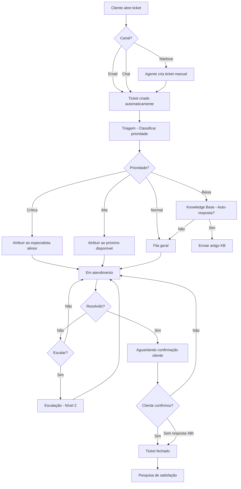

# Output Examples — ClickUp Configuration

## Exemplo 1: Design de Departamento (Output do Ernesto Estrutura)

### Departamento: Suporte

#### Fluxograma Mermaid



#### Documentação do Processo

**Space**: Suporte
**Descrição**: Gestão de tickets e atendimento ao cliente Nexuz

**Folders:**
- `Tickets` — Tickets ativos de suporte
- `Knowledge Base` — Artigos e documentação
- `Escalations` — Tickets escalados para nível 2+

**List "Tickets" — Statuses:**
| Status | Grupo | Cor |
|---|---|---|
| Novo | Active | 🔵 Azul |
| Em Triagem | Active | 🟡 Amarelo |
| Em Atendimento | Active | 🟠 Laranja |
| Aguardando Cliente | Active | 🟣 Roxo |
| Escalado | Active | 🔴 Vermelho |
| Resolvido | Closed | 🟢 Verde |

**Custom Fields:**
| Campo | Tipo | Opções |
|---|---|---|
| Prioridade | Dropdown | Crítica, Alta, Normal, Baixa |
| Canal Origem | Dropdown | Email, Chat, Telefone, WhatsApp |
| SLA (horas) | Number | — |
| Tempo Resposta | Formula | now() - created_at |
| Satisfação | Rating (1-5) | — |
| Cliente | Text | — |
| Produto | Dropdown | NXZ ERP, NXZ Go, NXZ KDS, NXZ Delivery |

**Automações:**
1. Quando status = "Novo" → Assign ao agente de plantão
2. Quando prioridade = "Crítica" → Notificar gerente de suporte
3. Quando SLA > 80% → Notificar responsável
4. Quando status = "Resolvido" → Enviar pesquisa satisfação (via integração)
5. Quando todas subtasks resolvidas → Mudar status para "Resolvido"

**Views:**
- Board (Kanban por status) — visão principal
- List (todos os tickets) — para filtros avançados
- Calendar (por deadline SLA) — para gestão de prazos

---

## Exemplo 2: Relatório de Auditoria (Output do Rui Revisão)

```
==============================
 REVIEW VERDICT: CONDITIONAL APPROVE
==============================

Departamento: Suporte
Configurado por: Carlos Configurador
Data: 2026-03-27
Revisão: 1 de 3

------------------------------
 SCORING TABLE
------------------------------
| Critério              | Score  | Resumo                                          |
|----------------------|--------|-------------------------------------------------|
| Hierarquia           | 9/10   | Estrutura clara e bem organizada                |
| Custom Fields        | 8/10   | Campos relevantes, tipos adequados              |
| Statuses             | 7/10   | Funcionais mas falta "Em Espera"                |
| OKRs e Goals         | 6/10   | Goals criados mas 1 OKR com só 2 KRs            |
| Automações           | 8/10   | Automações essenciais configuradas              |
| Views                | 9/10   | Views adequadas ao workflow                     |
------------------------------
 OVERALL: 7.8/10
------------------------------

DETAILED FEEDBACK:

Strength: Hierarquia segue exatamente o design aprovado. Folders bem nomeados
e Lists organizadas por tipo de processo.

Strength: Automação de SLA está configurada corretamente e testada com task de exemplo.

Required change: O Objective "Melhorar atendimento ao cliente" tem apenas 2 Key Results.
Adicionar pelo menos 1 KR adicional. Sugestão: "Reduzir tickets reabertos para < 5% do total".

Suggestion (non-blocking): Considerar adicionar status "Em Espera" entre "Em Atendimento"
e "Aguardando Cliente" para diferenciar pausa interna vs pausa por dependência do cliente.

Suggestion (non-blocking): O Custom Field "Tempo Resposta" como Formula pode não funcionar
como esperado. Verificar se ClickUp suporta now() em formulas. Alternativa: usar automação
que calcula e preenche o campo quando status muda.

PATH TO APPROVAL:
1. Adicionar 3º Key Result ao Objective de Suporte
2. Resubmeter como Revisão 2

VERDICT: CONDITIONAL APPROVE — Um ajuste obrigatório no OKR.
```
