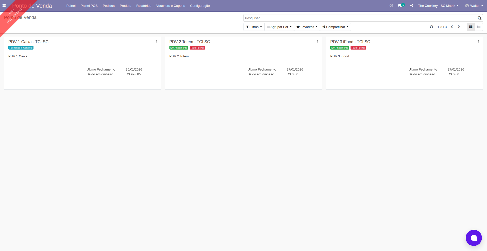
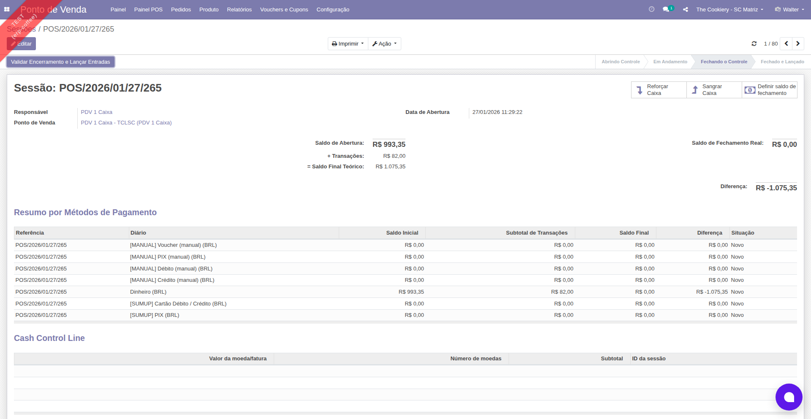
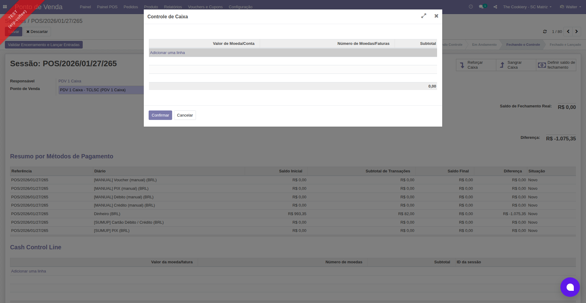
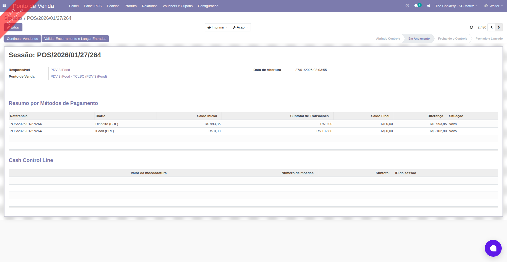
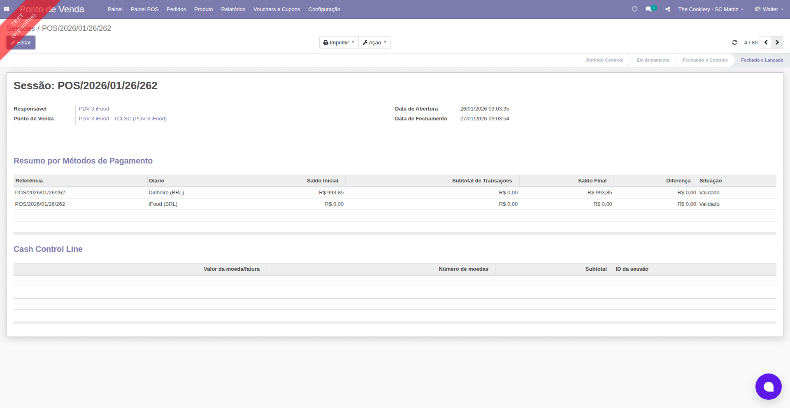

# Como Abrir e Fechar uma Sessao do Ponto de Venda

**Modulo:** Ponto de Venda (PDV)
**Persona:** Operador de Caixa
**Nivel:** Basico
**Tempo estimado:** 10 minutos

## Indice

1. [Objetivo](#objetivo)
2. [Pre-requisitos](#pre-requisitos)
3. [Parte 1: Abrir uma Sessao](#parte-1-abrir-uma-sessao)
4. [Parte 2: Fechar uma Sessao](#parte-2-fechar-uma-sessao)
5. [Resumo](#resumo)
6. [Proximos Passos](#proximos-passos)

## Objetivo

Ao final deste tutorial, voce sabera como iniciar uma nova sessao do Ponto de Venda, informar o saldo inicial do caixa, e fechar a sessao ao final do expediente com a contagem de caixa correta.

## Pre-requisitos

- [ ] Acesso ao sistema NXZ ERP com usuario e senha
- [ ] Permissao do grupo Ponto de Venda (perfil de Usuario ou Gerente)
- [ ] Um Ponto de Venda configurado e atribuido ao seu usuario (ex: Caixa 01)
- [ ] Nenhuma outra sessao aberta no mesmo PDV ou com o mesmo usuario

## Passo a Passo

### Parte 1: Abrir uma Sessao

#### Passo 1: Acesse o modulo Ponto de Venda

No menu lateral esquerdo do NXZ ERP, clique em **Ponto de Venda**.

O sistema exibe o **Painel**, que mostra os pontos de venda disponiveis como cartoes. Cada cartao exibe o nome do PDV, o status da sessao, o operador responsavel e a data do ultimo fechamento.

*Figura 1: Painel do Ponto de Venda com os cartoes dos PDVs disponiveis*

#### Passo 2: Inicie uma nova sessao

Localize o cartao do PDV que voce deseja operar (ex: **Caixa 01**).

Clique no botao **Nova Sessao** no cartao.

> **Dica:** Se o cartao mostrar o botao **Abrir Sessao** em vez de **Nova Sessao**, significa que uma sessao ja foi criada e esta aguardando a definicao do saldo inicial. Clique em **Abrir Sessao** para continuar.

#### Passo 3: Informe o saldo inicial do caixa

O sistema abre o formulario da sessao no estado **Controle de Abertura**.

Clique no botao **Definir Saldo Inicial** na area de botoes do formulario.

> **Nota:** A tela do formulario da sessao e semelhante a imagem abaixo, porem no estado **Abrindo Controle** o botao exibido sera **Abrir Sessao** e os campos de saldo de fechamento nao estarao visiveis.

*Figura 2: Formulario da Sessao do PDV (exemplo no estado Fechando o Controle, com campos de resumo financeiro e botoes de controle de caixa)*

#### Passo 4: Faca a contagem de notas e moedas

Uma janela popup de **Controle de Caixa** sera exibida.

Para cada tipo de nota ou moeda presente no caixa, preencha a coluna **Numero de Moedas/Faturas** com o numero de unidades. O sistema calcula o **Subtotal** automaticamente.

Apos preencher todas as linhas, clique em **Confirmar**.

*Figura 3: Janela de Controle de Caixa para contagem de notas e moedas*

> **Dica:** Se o caixa estiver vazio (inicio do dia sem troco), voce pode deixar todas as quantidades em zero e confirmar.

#### Passo 5: Abra a sessao

De volta ao formulario da sessao, verifique o valor do **Saldo Inicial** exibido.

Clique no botao **Abrir Sessao** no topo do formulario.

#### Passo 6: Acesse a interface de vendas

A sessao agora esta no estado **Em Andamento**.

Clique no botao **Continuar Vendendo** para abrir a interface de vendas do PDV, onde voce pode registrar pedidos e processar pagamentos.

*Figura 4: Sessao no estado Em Andamento, com botoes Continuar Vendendo e Validar Encerramento*

> **Dica:** Voce pode voltar ao Painel a qualquer momento e clicar em **Continuar Vendendo** no cartao do PDV para retornar a interface de vendas.

---

### Parte 2: Fechar uma Sessao

#### Passo 7: Acesse o formulario da sessao

No **Painel** do Ponto de Venda, localize o cartao do PDV com a sessao ativa (o status mostra **Em Andamento**).

Clique no botao **Fechar** no cartao.

#### Passo 8: Inicie o encerramento da sessao

No formulario da sessao, clique no botao **Encerrar Sessao** no topo.

A sessao muda para o estado **Controle de Fechamento**.

#### Passo 9: Informe o saldo final do caixa

Clique no botao **Definir saldo de fechamento** na area de botoes do formulario.

*Figura 5: Formulario da Sessao no estado Fechando o Controle, com botao Definir saldo de fechamento no canto superior direito*

#### Passo 10: Faca a contagem final de notas e moedas

Na janela popup de **Controle de Caixa**, preencha o **Numero de Moedas/Faturas** de cada nota e moeda presente no caixa neste momento.

Clique em **Confirmar**.

*Figura 6: Janela de Controle de Caixa para contagem de fechamento*

#### Passo 11: Verifique os valores e valide o fechamento

De volta ao formulario, confira os seguintes valores na secao de resumo financeiro:

- **Saldo de Abertura**: valor informado na abertura da sessao
- **+ Transacoes**: total de vendas em dinheiro durante a sessao
- **= Saldo Final Teorico**: valor calculado pelo sistema (saldo inicial + vendas em dinheiro)
- **Saldo de Fechamento Real**: valor que voce informou na contagem
- **Diferenca**: diferenca entre o teorico e o real

Clique no botao **Validar Encerramento e Lancar Entradas**.

> **Alerta:** Se a diferenca entre o saldo teorico e o real for muito alta, o sistema pode bloquear o fechamento. Nesse caso, procure o gerente do PDV para autorizar o fechamento.

#### Passo 12: Sessao encerrada

O sistema confirma todos os pedidos, reconcilia os pagamentos e contabiliza os lancamentos financeiros. A sessao muda para o estado **Fechado e Lancado**.

*Figura 7: Sessao no estado Fechado e Lancado, com Data de Abertura, Data de Fechamento e metodos de pagamento validados*

Voce sera redirecionado ao **Painel**, que agora exibe a data do ultimo fechamento e o saldo de caixa final no cartao do PDV.

## Resumo

Neste tutorial, voce aprendeu a:

- Acessar o modulo Ponto de Venda pelo menu lateral
- Iniciar uma nova sessao do PDV a partir do Painel
- Informar o saldo inicial do caixa usando a contagem de notas e moedas
- Abrir a sessao e acessar a interface de vendas
- Iniciar o fechamento da sessao ao final do expediente
- Informar o saldo final do caixa
- Verificar a diferenca entre o saldo teorico e real
- Validar o fechamento e contabilizar a sessao

## Proximos Passos

- **Registrar vendas no PDV**: aprenda a usar a interface de vendas para registrar pedidos e processar pagamentos
- **Entrada e saida de dinheiro**: como registrar suprimentos (entrada) e sangrias (saida) durante a sessao
- **Relatorio de fechamento**: como acessar e imprimir o relatorio Z de fechamento do caixa
