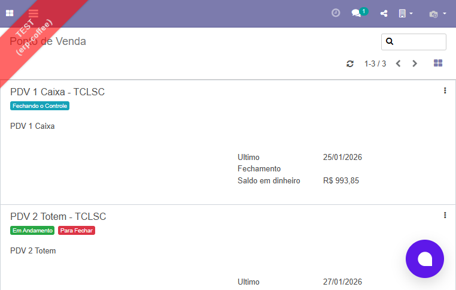
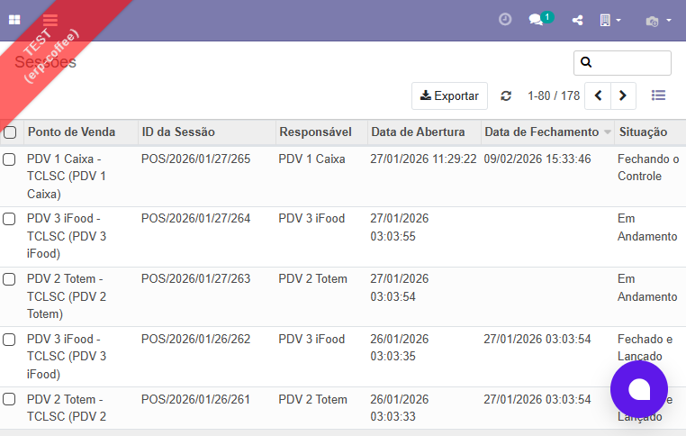
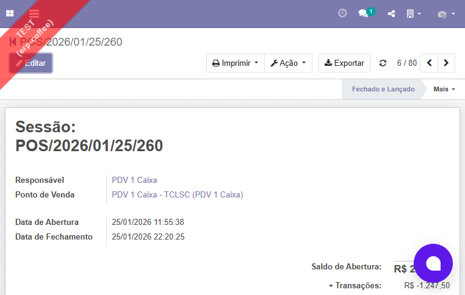
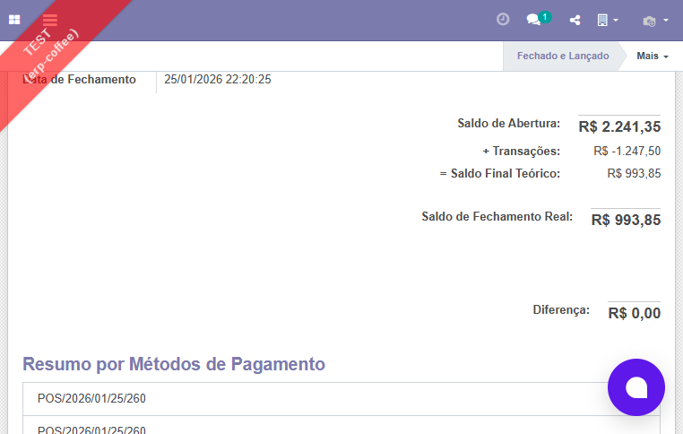
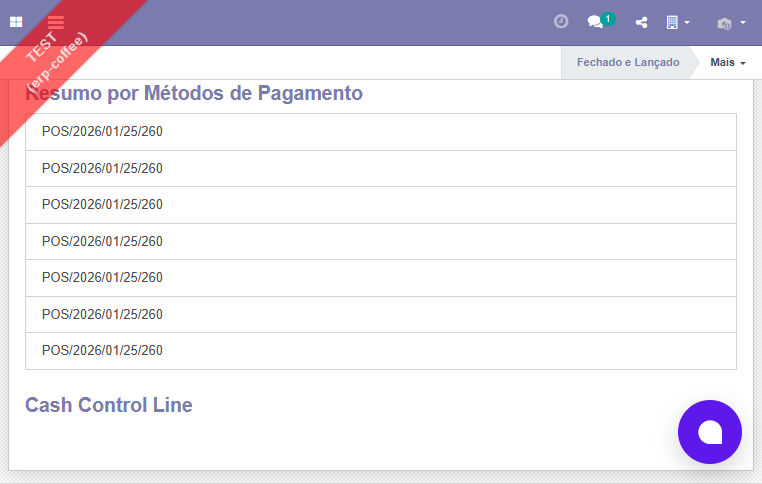
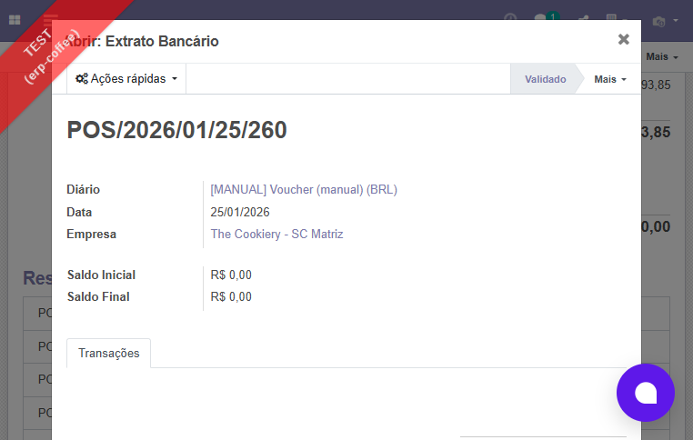

# Como Consultar as Sangrias no NXZ ERP

**Modulo:** Ponto de Venda (PDV)
**Persona:** Gerente de Operacao
**Nivel:** Basico
**Tempo estimado:** 5 minutos

## Indice

1. [Objetivo](#objetivo)
2. [Pre-requisitos](#pre-requisitos)
3. [Antes de Comecar](#antes-de-comecar)
4. [Passo a Passo](#passo-a-passo)
5. [Resumo](#resumo)
6. [Proximos Passos](#proximos-passos)

## Objetivo

Ao final deste tutorial, voce sabera como acessar e consultar os registros de sangrias (retiradas de dinheiro do caixa) realizadas nas sessoes do Ponto de Venda no NXZ ERP.

## Pre-requisitos

- [ ] Acesso ao NXZ ERP com usuario e senha
- [ ] Permissao de acesso ao modulo Ponto de Venda
- [ ] Permissao para visualizar sessoes do PDV

## Antes de Comecar

No NXZ ERP, as sangrias sao registradas dentro de cada sessao do Ponto de Venda. Nao existe um relatorio separado so de sangrias. Para consultar as sangrias, voce vai acessar a sessao do caixa desejada e verificar as linhas de controle de caixa (chamadas de "Cash Control Line" no sistema). Cada sangria aparece como uma linha nessa secao.

## Passo a Passo

### Passo 1: Acesse o modulo Ponto de Venda

Clique no menu **Ponto de Venda** na barra lateral esquerda do NXZ ERP.

O sistema exibe o painel principal com os terminais PDV disponiveis em formato de cards. Cada card mostra o nome do terminal, o status da sessao atual e o saldo em dinheiro.

*Figura 1: Painel principal do Ponto de Venda com os terminais PDV disponiveis*

### Passo 2: Abra a lista de sessoes

Clique no menu **Pedidos** e depois em **Sessoes**.

O sistema exibe a lista de todas as sessoes do PDV. Cada linha mostra o terminal (Ponto de Venda), o identificador da sessao, o responsavel, a data de abertura, a data de fechamento e a situacao.

*Figura 2: Lista de sessoes do PDV com todas as colunas de informacao*

> **Dica:** Voce pode filtrar as sessoes por periodo usando os filtros de data no topo da lista. Tambem pode ordenar por data de abertura clicando no cabecalho da coluna.

### Passo 3: Selecione a sessao desejada

Clique na linha da sessao que deseja consultar.

Escolha uma sessao com a situacao **Fechado e Lancado** para ver os dados completos de sangrias. Sessoes com situacao "Em Andamento" podem ainda nao ter todas as sangrias registradas.

*Figura 3: Formulario da sessao selecionada com dados do responsavel, terminal e datas*

### Passo 4: Visualize os dados gerais da sessao

O sistema abre o formulario da sessao com os dados de movimentacao financeira.

Na parte superior, voce encontra os campos:
- **Saldo de Abertura**: valor em dinheiro no caixa ao abrir a sessao
- **+ Transacoes**: soma de todas as movimentacoes em dinheiro (incluindo sangrias como valores negativos)
- **= Saldo Final Teorico**: calculo automatico (Abertura + Transacoes)
- **Saldo de Fechamento Real**: valor contado fisicamente no fechamento
- **Diferenca**: diferenca entre o saldo teorico e o real (o ideal e R$ 0,00)

*Figura 4: Campos financeiros da sessao com saldos de abertura, transacoes e fechamento*

> **Dica:** Se o campo **Diferenca** mostra um valor diferente de R$ 0,00, significa que o valor fisico no caixa nao bateu com o calculado pelo sistema. Isso pode indicar uma sangria nao registrada ou um erro de troco.

### Passo 5: Localize a secao Cash Control Line

Role a pagina para baixo ate encontrar a secao **Cash Control Line**.

Essa secao contem todas as movimentacoes manuais de dinheiro do caixa, incluindo as sangrias. Cada linha mostra o tipo de movimentacao e o valor correspondente.

*Figura 5: Secao Cash Control Line onde ficam registradas as sangrias e suprimentos*

> **Dica:** As sangrias aparecem como valores na lista de Cash Control Line. Verifique a descricao de cada linha para identificar quais sao sangrias e quais sao suprimentos (entradas de dinheiro).

### Passo 6: Consulte o extrato detalhado de dinheiro (opcional)

Para ver um detalhamento completo das movimentacoes em dinheiro, localize a secao **Resumo por Metodos de Pagamento** no formulario da sessao.

Clique no card do metodo **Dinheiro**.

O sistema abre um dialog com o **Extrato Bancario** do caixa, mostrando:
- **Saldo Inicial** e **Saldo Final**
- Lista de todas as transacoes em dinheiro (vendas, sangrias, suprimentos)
- **Saldo Calculado** para conferencia

*Figura 6: Dialog do Extrato Bancario com detalhamento das transacoes por metodo de pagamento*

## Resumo

Neste tutorial voce aprendeu a:
- Acessar o modulo Ponto de Venda
- Navegar ate a lista de sessoes do PDV
- Abrir uma sessao para ver os dados financeiros
- Localizar as sangrias na secao Cash Control Line
- Consultar o extrato detalhado de dinheiro pelo Resumo por Metodos de Pagamento

## Proximos Passos

- **Como Abrir e Fechar uma Sessao do Ponto de Venda**: aprenda a gerenciar sessoes de caixa
- **Como Registrar uma Sangria no PDV**: aprenda a realizar sangrias durante uma sessao ativa
- **Como Gerar o Relatorio de Detalhes de Vendas**: veja como gerar relatorios consolidados por periodo
