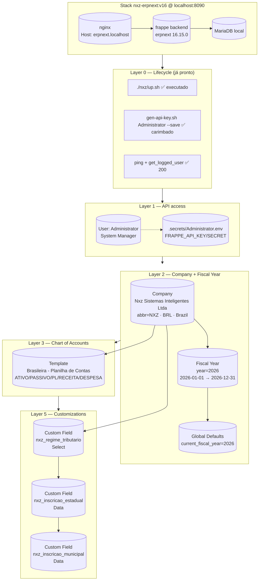

# ERPNext Design Document (EDD) — Nxz

**Arquiteto:** Paulo Processos (📐)
**Data:** 2026-04-22
**Run ID:** 2026-04-22-150201
**Escopo:** Núcleo — Stack lifecycle + API access + Company + Fiscal Year + Chart of Accounts
**Customization level:** Liberal (propostas avulsas permitidas, tudo revisado em Step 07)
**Baseado em:**
- `pipeline/data/interview-data.md` (Ana — 2026-04-22)
- `output/2026-04-22-150201/v1/research-findings.md` (Rita — 2026-04-22)
- `skills/erpnext-integration/SKILL.md`
- `frappe_docker/docs/nxz/*` (7 docs)

## Sumário executivo

Configuração mínima da Company **Nxz Sistemas Inteligentes Ltda** (abbr `NXZ`) com Chart of Accounts nativo brasileiro e Fiscal Year 2026. Três Custom Fields com prefixo `nxz_` preparam a base para regime tributário e inscrições fiscais sem colidir com apps BR futuros. Nenhum app de localização BR é instalado (nenhum maduro para v16 hoje).

**Total estimado:** ~7 operações POST + 2 GET de idempotência + 1 `set_value` (Global Defaults) = **~10 chamadas à API**.
**Duração estimada da execução (Step 08):** ~30s (com delay de 300ms entre POSTs).

## Arquitetura Geral



## Deltas vs. Entrevista

| # | Delta | Camada | Justificativa | Flag |
|---|---|---|---|---|
| D1 | **Abandonar Custom Field `cnpj`** e usar `Company.tax_id` nativo | 2 | Research Rita §6: `tax_id` nativo serve como CNPJ genérico. Criar `nxz_cnpj` colidiria quando app BR for instalado (apps v15 criam `cnpj` sem prefixo). | ⚠️ aprovar |
| D2 | **Trocar template COA** `"Brazil - Default COA"` → `"Brasileira - Planilha de Contas"` | 3 | Research Rita §3: template "Brazil - Default COA" **não existe no v16** — crasha com 500 AttributeError. Nome real validado via endpoint `get_charts_for_country`. | 🔴 bloqueante (fix obrigatório) |
| D3 | **Prefixar Custom Fields com `nxz_`** (`nxz_regime_tributario`, `nxz_inscricao_estadual`, `nxz_inscricao_municipal`) | 5 | Research Rita §6: convenção de namespace evita colisão futura com apps regionais BR. Não estava explícito na entrevista mas é boa prática da própria skill. | ⚠️ aprovar |
| D4 | **Fiscal Year default via `Global Defaults`** (não via `is_default` no doctype) | 2 | Research Rita §9: `is_default` não existe no doctype `Fiscal Year` no v16. Correto é `frappe.client.set_value` em `Global Defaults.current_fiscal_year`. | ⚠️ aprovar (ajuste técnico) |
| D5 | **NÃO criar usuário AI Team nesta run** | 1 | Config focus: user escolheu Administrator; recomendação de AI Team vai para documentação (Step 11). | ℹ️ informativo |
| D6 | **Layer 0 reduzida** (stack já up, secret já carimbado) | 0 | Scope selection: stack já rodando. Configurator executa apenas smoke tests de pré-voo, não roda `gen-api-key.sh` novamente (rotaciona secret e quebra tokens em uso). | ℹ️ informativo |
| D7 | **CNPJ fica em placeholder `00.000.000/0001-00`** | 2 | Sponsor não forneceu CNPJ real durante a entrevista. `Company.tax_id` criado com placeholder; atualização posterior via `PUT /api/resource/Company/...`. | ℹ️ informativo |

## Estimativa de operações

| Layer | Operações | Endpoint principal | Idempotência |
|---|---|---|---|
| 0 | 2 GETs (ping + auth) | `GET /api/method/ping` · `GET /api/method/frappe.auth.get_logged_user` | N/A |
| 1 | 0 POSTs (Administrator existe) | — | N/A |
| 2 | 1 GET + 1 POST (Company) + 1 GET + 1 POST (Fiscal Year) + 1 `set_value` (Global Defaults) | `POST /api/resource/Company` · `POST /api/resource/Fiscal Year` | GET /api/resource/Company/...Ltda (404 → POST) |
| 3 | 0 POSTs (COA criado implicitamente via `Company.chart_of_accounts`) + 1 GET para listar árvore criada | `GET /api/resource/Account?filters=...` | N/A |
| 5 | 3 GETs + 3 POSTs (Custom Field) | `POST /api/resource/Custom Field` | GET /api/resource/Custom Field?filters=[[dt,=,Company],[fieldname,=,nxz_...]] |

**Total:** 7 GETs + 6 POSTs + 1 set_value = **14 chamadas**. Delay 300ms entre POSTs = **~2s net runtime**, ~30s com overhead.

## Layer 0 — Stack Lifecycle

**Decisão:** Assumir stack **up** (sponsor confirmou em Step 00). **NÃO rodar:**
- `./nxz/up.sh` (já rodando)
- `./nxz/reset.sh` (destrutivo)
- `./nxz/gen-api-key.sh` (rotaciona secret ativo, footgun)

**Ações do Configurator:**
1. Resolver `HTTP_PUBLISH_PORT` de `frappe_docker/nxz/.env` (esperado `8090`).
2. Source `frappe_docker/nxz/.secrets/Administrator.env`.
3. Smoke test 1: `GET /api/method/ping` → espera `{"message":"pong"}`.
4. Smoke test 2: `GET /api/method/frappe.auth.get_logged_user` → espera `{"message":"Administrator"}`.
5. Se qualquer smoke test falhar → abortar com mensagem clara (não tentar `gen-api-key.sh` automaticamente; requer aprovação).

## Layer 1 — API Access + Users

**Decisão:** Reusar `Administrator` (já existe, já tem API key carimbado). **Não criar usuário AI Team nesta run.**

**Recomendação futura (Step 11 documentação):** criar `email@nxz.ai` com Role `System Manager` + `Role Profile` dedicado em próxima run quando migrar para produção. Script:
```json
{
  "doctype": "User",
  "email": "ai@nxz.ai",
  "first_name": "AI",
  "last_name": "Team",
  "user_type": "System User",
  "roles": [{"role": "System Manager"}]
}
```

## Layer 2 — Company + Fiscal Year

### 2.1 Company

**Endpoint:** `POST /api/resource/Company`
**Idempotência:** `GET /api/resource/Company/Nxz%20Sistemas%20Inteligentes%20Ltda` — se 200, skip; se 404, POST.

**Payload:**
```json
{
  "company_name": "Nxz Sistemas Inteligentes Ltda",
  "abbr": "NXZ",
  "default_currency": "BRL",
  "country": "Brazil",
  "chart_of_accounts": "Brasileira - Planilha de Contas",
  "tax_id": "00.000.000/0001-00"
}
```

**Notas:**
- `tax_id` nativo substitui Custom Field `cnpj` (Delta D1).
- Template COA correto confirmado via `get_charts_for_country?country=Brazil` (Delta D2).
- Criação da Company dispara criação automática de tree de Cost Centers + Warehouses padrão + COA completo com ~100+ Accounts.

### 2.2 Fiscal Year

**Endpoint:** `POST /api/resource/Fiscal Year`
**Idempotência:** `GET /api/resource/Fiscal%20Year/2026` — se 200, skip.

**Payload:**
```json
{
  "year": "2026",
  "year_start_date": "2026-01-01",
  "year_end_date": "2026-12-31",
  "companies": [{ "company": "Nxz Sistemas Inteligentes Ltda" }]
}
```

### 2.3 Definir Fiscal Year Default (via Global Defaults — Delta D4)

**Endpoint:** `POST /api/method/frappe.client.set_value`

**Payload:**
```json
{
  "doctype": "Global Defaults",
  "name": "Global Defaults",
  "fieldname": "current_fiscal_year",
  "value": "2026"
}
```

## Layer 3 — Chart of Accounts

**Decisão:** COA é criado **implicitamente** pela Company (via `chart_of_accounts: "Brasileira - Planilha de Contas"`). Não é necessário POST em `/api/resource/Account`.

**Verificação pós-criação:**
```bash
curl -s -H "Host: erpnext.localhost" -H "Authorization: token $FRAPPE_API_KEY:$FRAPPE_API_SECRET" \
     "http://localhost:8090/api/resource/Account?filters=%5B%5B%22company%22%2C%22%3D%22%2C%22Nxz%20Sistemas%20Inteligentes%20Ltda%22%5D%5D&fields=%5B%22name%22%2C%22account_name%22%2C%22parent_account%22%2C%22root_type%22%2C%22is_group%22%5D&limit_page_length=500"
```

Esperado: retorno com ~100+ Accounts nomeadas `<nome> - NXZ`, com raízes:
- `ATIVO - NXZ` (root_type=Asset)
- `PASSIVO - NXZ` (root_type=Liability)
- `PATRIMÔNIO LÍQUIDO - NXZ` (root_type=Equity)
- `RECEITA - NXZ` (root_type=Income)
- `DESPESA - NXZ` (root_type=Expense)

**Veto:** se o GET retornar 0 Accounts → COA não foi criado → reportar falha silenciosa do template para o Reviewer.

## Layer 5 — Customizations (3 Custom Fields — Delta D3)

### 5.1 Custom Field `nxz_regime_tributario`

**Endpoint:** `POST /api/resource/Custom Field`
**Idempotência:** `GET /api/resource/Custom%20Field?filters=%5B%5B%22dt%22%2C%22%3D%22%2C%22Company%22%5D%2C%5B%22fieldname%22%2C%22%3D%22%2C%22nxz_regime_tributario%22%5D%5D`

```json
{
  "dt": "Company",
  "fieldname": "nxz_regime_tributario",
  "label": "Regime Tributário",
  "fieldtype": "Select",
  "options": "\nSimples Nacional\nLucro Presumido\nLucro Real",
  "insert_after": "tax_id",
  "reqd": 0
}
```

### 5.2 Custom Field `nxz_inscricao_estadual`

```json
{
  "dt": "Company",
  "fieldname": "nxz_inscricao_estadual",
  "label": "Inscrição Estadual",
  "fieldtype": "Data",
  "insert_after": "nxz_regime_tributario",
  "reqd": 0
}
```

### 5.3 Custom Field `nxz_inscricao_municipal`

```json
{
  "dt": "Company",
  "fieldname": "nxz_inscricao_municipal",
  "label": "Inscrição Municipal",
  "fieldtype": "Data",
  "insert_after": "nxz_inscricao_estadual",
  "reqd": 0
}
```

### 5.4 Setar `nxz_regime_tributario` da Company Nxz

Após criar os Custom Fields, popular o valor declarado na entrevista (**Simples Nacional**):

```json
{
  "doctype": "Company",
  "name": "Nxz Sistemas Inteligentes Ltda",
  "fieldname": "nxz_regime_tributario",
  "value": "Simples Nacional"
}
```

Via `POST /api/method/frappe.client.set_value`.

## JSON Specs (para Step 08)

Arquivos gerados em `squads/nxz-erpnext-setup/specs/`:
- `02-company.json` — payload Company
- `03-fiscal-year.json` — payload Fiscal Year + set_value Global Defaults
- `05-custom-fields.json` — 3 Custom Fields + set_value regime_tributario

(Layers 1 e 3 são zero-POST nesta run — executados implicitamente ou reusando Administrator.)

## Ordem de Execução (Caio deve seguir)

1. **Layer 0** — smoke tests (ping + auth)
2. **Layer 2.1** — GET Company → se 404, POST com `chart_of_accounts=Brasileira - Planilha de Contas` (dispara Layer 3 implicitamente)
3. **Layer 2.2** — GET Fiscal Year 2026 → se 404, POST
4. **Layer 2.3** — `set_value` Global Defaults.current_fiscal_year = "2026"
5. **Layer 3 (verificação)** — GET Accounts da Company → validar 100+ retornados
6. **Layer 5.1** — GET Custom Field nxz_regime_tributario → se não existe, POST
7. **Layer 5.2** — GET + POST nxz_inscricao_estadual
8. **Layer 5.3** — GET + POST nxz_inscricao_municipal
9. **Layer 5.4** — `set_value` Company.nxz_regime_tributario = "Simples Nacional"

**Delay entre POSTs:** 300ms (regra da skill — protege MariaDB dev local).

## Auto-veto (Paulo)

- [x] Entrevista lida como fonte primária (Bloco 1/2/3 cada um tem contraparte no EDD)
- [x] Nenhum bloco da entrevista omitido
- [x] Deltas vs. entrevista sinalizados em seção dedicada (7 deltas, sendo 1 bloqueante)
- [x] Ordem de execução respeita dependências (Company antes de Fiscal Year antes de Custom Fields)
- [x] JSON specs gerados em `squads/nxz-erpnext-setup/specs/`
- [x] Estimativa de volume (14 chamadas, ~30s net)
- [x] Diagrama Mermaid da arquitetura
