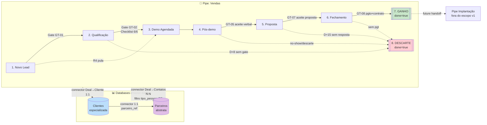

# Design Pipefy — Nexuz Vendas

**Run:** 2026-04-20-162723  
**Baseado em:** PDD-NXZ-VENDAS-001 v1.0 (2026-04-17)  
**Plano Pipefy:** Enterprise/Unlimited (quota ≥ 2.000 automation jobs/mês)  
**Decisões de design:** ver `design-decisions.md` (DD-001 a DD-004)

---

## 1. Arquitetura Geral



**Modelo CTI no escopo desta execução:**
- `Parceiros` (abstrata) — qualquer pessoa/empresa que se relacione com a Nexuz. Contém campos comuns (nome, documento, email, endereço, status).
- `Clientes` (especializada) — campos específicos de relacionamento comercial. Connector 1:1 para `Parceiros`.
- **Contatos** (PF vinculados a uma Cliente) ficam como **registros em `Parceiros`** com `tipo_pessoa=PF`. Não é criada tabela `Contatos` separada — CTI dispensa.

---

## 2. Estimativa de Quota de Automações

| Cenário | Volume/mês | Jobs/deal médio | Total jobs/mês |
|---|---|---|---|
| Deals criados | 15–25 | 1× data_mql + 1× data_sal + 1× data_ganho = 3 | 45–75 |
| Cadência Qualificação (3 toques automáticos D+1/D+3/D+7) | 12–20 deals | 3 emails | 36–60 |
| Proposta D+3 email auto + D+7 alerta + D+15 decisão | 5–10 deals | 3 | 15–30 |
| Alertas SLA (Qualificação D+8, Pós-demo D+3, Proposta D+15, Fechamento D+5) | variável | ~1 por deal ocioso | 20–40 |
| GANHO automático (pagto+contrato both true) | 3–5 | 1 | 3–5 |
| Desconto > 15% alerta Gestão | ~1 | 1 | 1–3 |
| Feedback ao indicador D+7 | 2 | 1 | 2 |
| Audit diário Clientes duplicados (DD-002 camada 3) | 30 (1/dia) | 1 | 30 |
| **Total pico estimado** | | | **~250 jobs/mês** |
| **Quota plano Enterprise** | | | **≥ 2.000/mês** |
| **Folga** | | | **~87%** |

**Conclusão:** o design cabe confortavelmente no plano Enterprise com folga para crescimento 5–8× antes de precisar otimizar. Revisitar em D+90 com dados reais (PDD §18, D+90 review).

---

## 3. Pipe: Vendas

### 3.1 Atributos do Pipe

| Atributo | Valor |
|---|---|
| `name` | Vendas |
| `icon` | `sales` |
| `public` | `true` |
| `anyone_can_create_card` | `false` |
| `create_card_label` | `Nova oportunidade` |
| `noun` | deal |
| `labels` | Temperatura (Frio/Morno/Quente), ICP (QS/FS/Fora ICP) |

### 3.2 Start Form (intake de qualquer origem)

| # | Field Label | Type | Required | Options / Condição | Gate PDD |
|---|---|---|---|---|---|
| 1 | Nome do contato | `short_text` | ✅ | — | R1/R2/R3 |
| 2 | E-mail | `email` | ✅ | — | R1/R2/R3 |
| 3 | Telefone/WhatsApp | `phone` | ✅ | — | R1/R2/R3 |
| 4 | Empresa (razão social ou fantasia) | `short_text` | ✅ | — | R1/R2/R3 |
| 5 | Origem | `select` | ✅ | Inbound / Outbound / Indicação / Evento / Parceiro | R1-R4 |
| 6 | Canal preferido | `select` | ✅ | WhatsApp / LinkedIn / Instagram / Facebook / E-mail / Ligação | R35 |
| 7 | Consentimento LGPD | `checkbox` | ✅ se Origem=Inbound | Condicional | LGPD §17 |
| 8 | Quem indicou | `short_text` | ✅ se Origem=Indicação | Condicional | R3 |
| 9 | Contexto da indicação | `long_text` | ❌ | Condicional Indicação | R3 |
| 10 | Reason to Call | `long_text` | ✅ se Origem=Outbound | Condicional | R2 |
| 11 | ICP | `select` | ✅ se Origem=Outbound | QS / FS / Zona de fronteira / Fora de ICP | R2 |
| 12 | LinkedIn do contato | `short_text` | ✅ se Origem=Outbound | URL | R2 |
| 13 | Cargo | `short_text` | ✅ se Origem=Outbound | — | R2 |
| 14 | Cliente vinculado | `connector` → `Clientes` | ❌ | `can_connect_existing=true`, `can_create_new_connected=true`, `can_connect_multiples=false` | GT-01 |

**Observação:** Cliente vinculado é opcional no Start Form (lead recém-chegado pode não ter Cliente ainda). Torna-se required na Phase 3 (Demo Agendada) via gate de transição.

### 3.3 Phases

| # | Phase | done | SLA | Descrição |
|---|---|---|---|---|
| 1 | **Novo Lead** | false | 2h/48h conforme origem | Consolida 1A/1B/1C do PDD via campo Origem. Ops valida dados mínimos. |
| 2 | **Qualificação** | false | 8 dias corridos | Checklist Binário 6 itens (gate GT-02). Inbound com 6/6 na entrada pula pra Phase 3 (R4). |
| 3 | **Demo Agendada** | false | Data demo + 1d útil | Gate F-Demo. Demo QS ou FS conforme ICP. |
| 4 | **Pós-demo** | false | 3 dias corridos | Captura status_demo: aceite / sem aceite / no-show. |
| 5 | **Proposta** | false | 15 dias corridos | Envio + cadência de follow-up. Gate F-Proposta. |
| 6 | **Fechamento** | false | 10 dias (5 pgto + 3 contrato) | Gate F-Fechamento + F-GANHO. Coleta dados fiscais. |
| 7 | **GANHO** | **true** | automático | R19: pagto+contrato ambos true → move automático. |
| 8 | **DESCARTE** | **true** | imediato | R25: motivo obrigatório. Card nunca reaberto (R29). |

### 3.4 Fields por Phase

#### Phase 1 — Novo Lead
| Field | Type | Required | Observação |
|---|---|---|---|
| Ops responsável | `assignee_select` | ✅ (gate saída) | Gate GT-01 |
| Data entrada etapa | `datetime` | auto | Marco Lead |
| Statement: "Dados do lead" | `statement` | — | divisor visual |
| (todos os fields do Start Form aparecem aqui também) | — | — | herdado |

#### Phase 2 — Qualificação
| Field | Type | Required | Gate |
|---|---|---|---|
| **Checklist Binário** (6 itens) | — | — | F-Qualificação (saída) |
| 1. Fit confirmado (ICP compatível) | `checkbox` | ✅ | Item 1 |
| 2. Faturamento declarado | `checkbox` | ✅ | Item 2 |
| Faturamento mensal | `currency` | ✅ | suporte item 2 |
| 3. Dor central identificada | `checkbox` | ✅ | Item 3 |
| Dor central (texto) | `long_text` | ✅ | suporte item 3 |
| 4. Nº unidades registrado | `checkbox` | ✅ | Item 4 |
| Nº unidades | `number` | ✅ | suporte item 4 |
| 5. Decisor confirmado | `checkbox` | ✅ | Item 5 (+ ≥1 Contato com papel=Decisor) |
| 6. Urgência declarada | `checkbox` | ✅ | Item 6 |
| Urgência (texto) | `long_text` | ✅ | suporte item 6 |
| Statement: "Marcos" | `statement` | — | divisor |
| Data MQL | `datetime` | auto | Marco MQL (automação A-01) |
| Data SAL | `datetime` | auto (saída) | Marco SAL (automação A-02) |

#### Phase 3 — Demo Agendada
| Field | Type | Required | Gate |
|---|---|---|---|
| Cliente vinculado | `connector → Clientes` | ✅ (gate saída) | F-Demo |
| Contatos vinculados (≥1 decisor) | `connector → Parceiros` (filtro tipo_pessoa=PF) multiples | ✅ | F-Demo |
| Data da demo | `datetime` | ✅ | F-Demo |
| Tipo de demo | `radio_horizontal` (QS/FS) | ✅ | F-Demo |
| Quem vai conduzir | `assignee_select` | ✅ | — |
| Decisores na demo (texto) | `long_text` | ✅ | F-Demo |

#### Phase 4 — Pós-demo
| Field | Type | Required | Observação |
|---|---|---|---|
| Status demo | `select`: Realizada com aceite / Realizada sem aceite / No-show | ✅ | R9, R10 |
| Aceite verbal | `checkbox` | ✅ se Status=Realizada com aceite | Gate F-Proposta |
| Contagem de reagendamentos | `number` (default 0) | — | EXT-05 (≥3 → Nutrição) |
| Data da demo realizada | `date` | ✅ | F-Proposta |
| Dor confirmada | `checkbox` | ✅ | F-Proposta |

#### Phase 5 — Proposta
| Field | Type | Required | Observação |
|---|---|---|---|
| Data proposta enviada | `date` | ✅ | — |
| Proposta (anexo) | `attachment` | ❌ | FS: PDF consultivo |
| Preço base | `currency` | ✅ | R16 |
| Margem aplicada (%) | `number` | ✅ | R17 |
| Desconto (%) | `number` | ❌ | R13 (>15% dispara A-12) |
| Valor proposto final | `currency` | ✅ | R18 (cálculo manual ou fórmula) |
| MRR | `currency` | ✅ (gate) | F-Fechamento |
| Módulos contratados | `checklist_vertical` | ✅ (gate) | R18 portfolio PDD §15.3 |
| Statement: "Aceite" | `statement` | — | divisor |
| Aceite proposta | `checkbox` | ✅ (gate) | F-Fechamento (absoluto) |

#### Phase 6 — Fechamento
| Field | Type | Required | Observação |
|---|---|---|---|
| CNPJ | `cnpj` | ✅ | R31, R33 (validação 14 dígitos + unicidade) |
| Razão social | `short_text` | ✅ | F-GANHO |
| Boleto emitido | `checkbox` | ✅ (Financeiro) | R17 RACI |
| Pagamento confirmado | `checkbox` | ✅ (Financeiro, gate) | F-GANHO + R19 |
| Contrato assinado | `checkbox` | ✅ (Gestão, gate) | F-GANHO + R19 |

#### Phase 7 — GANHO (done=true)
| Field | Type | Required | Observação |
|---|---|---|---|
| Data Ganho | `datetime` | auto | Marco Ganho (A-03) |
| Handoff Implantação (card) | `connector` → Pipe Implantação | — | future, fora do escopo v1 |
| Notas de handoff | `long_text` | ❌ | PDD R40 pacote handoff |

#### Phase 8 — DESCARTE (done=true)
| Field | Type | Required | Observação |
|---|---|---|---|
| Motivo descarte | `select` (9 motivos PDD §13.1) | ✅ | R25, R26 (bloqueio absoluto) |
| Qual concorrente | `short_text` | ✅ se motivo="Perdeu pra concorrente" | R27 |
| Último canal tentado | `select` (canais) | ✅ se motivo="Sumiu/sem resposta" | R28 |
| Observação descarte | `long_text` | ❌ | — |
| Data descarte | `datetime` | auto | — |

### 3.5 Field Conditions (visibilidade dinâmica)

| # | Campo controlador | Valor | Campo alvo | Ação |
|---|---|---|---|---|
| FC-01 | Origem | = Inbound | Consentimento LGPD | Show + required |
| FC-02 | Origem | = Indicação | Quem indicou, Contexto da indicação | Show + required (Quem indicou) |
| FC-03 | Origem | = Outbound | Reason to Call, ICP, LinkedIn, Cargo | Show + required |
| FC-04 | Status demo | = Realizada com aceite | Aceite verbal | Show + required |
| FC-05 | Motivo descarte | = "Perdeu pra concorrente" | Qual concorrente | Show + required |
| FC-06 | Motivo descarte | = "Sumiu/sem resposta" | Último canal tentado | Show + required |

> **Nota (Rita §research-findings.md):** Field Conditions renderizam na UI mas NÃO bloqueiam escrita via API (limitação 2026-04-20). Scripts configuradores devem enviar todos os campos condicionais esperados.

### 3.6 Labels

| Label | Cor | Uso |
|---|---|---|
| Frio | #2979FF | Temperatura do deal (baixa) |
| Morno | #FFAB00 | Temperatura média |
| Quente | #FF3D00 | Temperatura alta |
| QS | #4CAF50 | ICP Quick Serve |
| FS | #FF9800 | ICP Full Serve |
| Fora ICP | #757575 | Fora do ICP |

### 3.7 Automações

| ID | Nome | Trigger | Condition | Action | Jobs estimados/mês |
|---|---|---|---|---|---|
| A-01 | Marcar Data MQL | `card_moved_to_phase` Qualificação | — | `update_card_field(data_mql=now())` | 15–25 |
| A-02 | Marcar Data SAL | `card_moved_to_phase` Demo Agendada | — | `update_card_field(data_sal=now())` | 12–20 |
| A-03 | Marcar Data Ganho | `card_moved_to_phase` GANHO | — | `update_card_field(data_ganho=now())` | 3–5 |
| A-04 | Cadência Qualificação D+1 | `card_entered_phase` Qualificação + scheduler(+1d) | Checklist < 6/6 | `send_email(ET-01)` | 12–20 |
| A-05 | Cadência Qualificação D+3 | `card_entered_phase` Qualificação + scheduler(+3d) | Checklist < 6/6 | `send_email(ET-02)` | 10–18 |
| A-06 | Cadência Qualificação D+7 | `card_entered_phase` Qualificação + scheduler(+7d) | Checklist < 6/6 | `send_email(ET-03)` | 8–15 |
| A-07 | SLA Qualificação D+8 alerta | `card_late` Qualificação > 8d | — | `notify_assignee` + atualiza label Frio | 3–8 |
| A-08 | Proposta D+3 follow-up auto | `card_entered_phase` Proposta + scheduler(+3d) | Aceite proposta = false | `send_email(ET-04)` | 5–10 |
| A-09 | Proposta D+7 alerta interno | `card_late` Proposta > 7d | — | `notify_assignee` | 3–6 |
| A-10 | Proposta D+15 decisão | `card_late` Proposta > 15d | — | `notify_assignee` + sugere Nutrição | 2–4 |
| A-11 | Fechamento 5d sem pgto | `card_late` Fechamento > 5d + field pagamento_confirmado=false | — | `notify_assignee` + Financeiro | 2–5 |
| A-12 | Desconto > 15% alerta Gestão | `card_field_updated` (desconto) | desconto > 15 | `notify` Sponsor | 1–3 |
| A-13 | GANHO automático | `card_field_updated` (pagto ou contrato) | pgto=true AND contrato=true | `move_card_to_phase` GANHO | 3–5 |
| A-14 | Feedback indicador D+7 | `card_entered_phase` Novo Lead + scheduler(+7d) | Origem=Indicação | `notify_assignee` (checklist) | 1–3 |
| A-15 | Bloqueio SLA Qualificação 48h inativo | `card_late` (nenhum update em 48h) em Qualificação | — | `notify_assignee` | 8–15 |
| A-16 | Audit Clientes duplicados | `recurring` daily 06:00 | — | `webhook` → serviço audit | 30 |

**Total pico:** ~250 jobs/mês. Quota Enterprise: 2.000/mês. Folga: 87%.

### 3.8 SLAs / Late Alerts

| Phase | Tempo máximo | Alerta | Automação |
|---|---|---|---|
| Novo Lead (Inbound/Indicação) | 2h úteis | Ops | (capability nativa de late alert) |
| Novo Lead (Outbound) | 48h úteis | Ops | (capability nativa) |
| Qualificação (inatividade) | 48h sem ação | Ops | A-15 |
| Qualificação (tempo total) | 8 dias corridos | Ops decide Nutrição/Descarte | A-07 |
| Demo Agendada | data demo + 1 dia útil | Ops | late alert |
| Pós-demo | 3 dias corridos | Ops | late alert |
| Proposta (follow-up) | 3 dias | E-mail auto | A-08 |
| Proposta (alerta interno) | 7 dias | Ops | A-09 |
| Proposta (decisão) | 15 dias | Ops decide | A-10 |
| Fechamento (CNPJ) | 48h | Ops | late alert |
| Fechamento (pagamento) | 5 dias úteis | Ops + Financeiro | A-11 |
| Fechamento (contrato) | 3 dias pós-pgto | Ops | late alert |
| DESCARTE (motivo vazio) | bloqueante | — | required field (R25) |

### 3.9 Email Templates

| ID | Nome | Trigger | Assunto | Body vars |
|---|---|---|---|---|
| ET-01 | Qualificação D+1 | A-04 | {empresa}, que bom te conhecer | {nome}, {empresa}, {reason_to_call or pain_hypothesis} |
| ET-02 | Qualificação D+3 | A-05 | {nome}, um insight que pode ajudar | {nome}, {empresa}, {ICP_content} |
| ET-03 | Qualificação D+7 | A-06 | {nome}, última tentativa esta semana | {nome}, {empresa}, {CTA_urgencia} |
| ET-04 | Proposta D+3 follow-up | A-08 | {nome}, conseguiu avaliar a proposta? | {nome}, {valor_proposto}, {proposta_url} |

Janela de envio (R36): segunda–sexta, 9h–18h. Automations configuradas com `schedule_frequency` respeitando horário comercial (quando suportado pela API; caso contrário, agendar para 09:00 BRT via automação do próprio Pipefy).

---

## 4. Database: Parceiros

Tabela abstrata com campos comuns a qualquer pessoa/empresa que se relacione com a Nexuz.

### 4.1 Atributos da Tabela
| Atributo | Valor |
|---|---|
| `name` | Parceiros |
| `icon` | `globe` |
| `public` | `false` |
| `authorization` | `write_access` (para Ops e Gestão) |
| `description` | Registro central de qualquer parceiro (PF ou PJ). Clientes, Fornecedores, Colaboradores, Contatos são especializações. |

### 4.2 Table Fields
| Field | Type | Required | Observação |
|---|---|---|---|
| Nome / Razão Social | `short_text` | ✅ | title_field |
| Nome Fantasia | `short_text` | ❌ | para PJ |
| Tipo pessoa | `select`: PF / PJ | ✅ | discriminador |
| Documento (CPF ou CNPJ) | `short_text` | ✅ | 11 ou 14 dígitos, validação custom |
| Categoria primária | `label_select` multi | ✅ | Cliente, Fornecedor, Colaborador, Contato, Prestador |
| E-mail principal | `email` | ❌ | — |
| Telefone/WhatsApp | `phone` | ❌ | — |
| CEP | `short_text` | ❌ | — |
| Endereço | `long_text` | ❌ | — |
| Cidade | `short_text` | ❌ | — |
| UF | `select` (27 UFs) | ❌ | — |
| Website | `short_text` | ❌ | URL |
| LinkedIn | `short_text` | ❌ | URL |
| Instagram | `short_text` | ❌ | @handle |
| Papel no comitê | `select`: Decisor/Influenciador/Operacional/Gatekeeper | ❌ | só PF (Contatos) |
| Conta mãe (se Contato) | `connector → Parceiros` (filtro tipo=PJ) | ❌ | PDD §3.2 |
| Status | `select`: Ativo / Inativo / Bloqueado | ✅ | — |
| Data cadastro | `datetime` | auto | — |
| Observações | `long_text` | ❌ | — |

### 4.3 Title field
`title_field` = `Nome / Razão Social` (nome principal). Isso ajuda busca e exibe em connectors.

---

## 5. Database: Clientes (especializada)

Tabela especializada para parceiros que são clientes comerciais da Nexuz.

### 5.1 Atributos da Tabela
| Atributo | Valor |
|---|---|
| `name` | Clientes |
| `icon` | `briefcase` |
| `public` | `false` |
| `authorization` | `write_access` (Ops e Gestão) |
| `description` | Especialização de Parceiros com dados comerciais. Connector 1:1 para Parceiros. |

### 5.2 Table Fields
| Field | Type | Required | Observação |
|---|---|---|---|
| Parceiro | `connector → Parceiros` | ✅ | `can_connect_multiples=false`. Base do CTI. |
| Código cliente | `id` | auto | — |
| Segmento/ICP | `select`: QS / FS / Zona fronteira / Fora ICP | ✅ | PDD §3.1 |
| Porte | `select`: Micro / Pequena / Média / Grande | ❌ | — |
| Nº unidades | `number` | ❌ | PDD §3.1 |
| Faturamento mensal | `currency` | ❌ | PDD §3.1 |
| Sistema atual | `short_text` | ❌ | PDD §3.1 |
| Status comercial | `select`: Prospect / Proposta / Ativo (Live) / Cancelado | ✅ | derivado de Deal |
| MRR atual | `currency` | ❌ | populado via automação em GANHO |
| Plano contratado | `checklist_vertical` | ❌ | módulos PDD §15.3 |
| Data primeiro contato | `date` | ❌ | — |
| Data Live (conversão) | `date` | ❌ | Marco Live |
| LTV estimado | `currency` | ❌ | futuro |
| NPS atual | `number` | ❌ | futuro |
| Observações comerciais | `long_text` | ❌ | — |

### 5.3 Title field
`title_field` = formula-like pattern: usar display `{parceiro.nome} [C-{id}]`. Pipefy não suporta formula no título nativamente — workaround: usar o próprio Parceiro (connector) como título visualmente. Se o Pipefy exigir field scalar como title, usar `short_text` populado por automação `record_field_updated(parceiro)` → `update_record_field(title_display = parceiro.razao_social)`.

### 5.4 Enforcement 1:1 (DD-002)

**Camada 1 — Pre-check client-side (obrigatório):**
Script configurador (Step 06) e qualquer futura criação de registro em `Clientes` deve, ANTES do `createTableRecord`, executar:
```graphql
query {
  findRecords(tableId: "CLIENTES_ID", search: {
    fieldsFilter: [{ fieldId: "parceiro", fieldValues: ["PARCEIRO_ID"] }]
  }, first: 1) {
    edges { node { id } }
  }
}
```
Se retornar edge → abortar criação com erro.

**Camada 2 — Title formula visual (sempre ligado):**
Title do Cliente = `{parceiro.nome} [C-{id}]` (via automação sync). Duplicatas apareceriam com o mesmo prefixo e diferentes sufixos de id, facilitando detecção visual.

**Camada 3 — Audit diário (A-16):**
Automação `recurring` daily 06:00 → webhook `https://audit.internal.nexuz.com.br/pipefy/clientes-duplicates` que:
1. Lista todos registros de `Clientes` com connector `parceiro`
2. Agrupa por `parceiro_id`, conta ocorrências
3. Para cada grupo count > 1 → notifica canal Slack `#ops-alertas` ou cria card em pipe "Incidentes de Dados" (futuro)

---

## 6. Connectors (relacionamentos)

| # | From | To | Campo | Cardinalidade | Propriedades |
|---|---|---|---|---|---|
| C-01 | Pipe Vendas (Start Form) | Clientes | `cliente_vinculado` | 1:1 | `can_create_new_connected=true`, `can_connect_existing=true`, `can_connect_multiples=false` |
| C-02 | Pipe Vendas (Phase 3) | Parceiros (filtro tipo=PF) | `contatos_vinculados` | N:1 (deal → ≥1 contato) | `can_connect_multiples=true`, `can_connect_existing=true`, `can_create_new_connected=true` |
| C-03 | Clientes | Parceiros | `parceiro` | 1:1 | **core do CTI**. `can_connect_multiples=false`. Enforcement por pre-check (DD-002). |
| C-04 | Parceiros (Contatos PF) | Parceiros (Empresa mãe PJ) | `conta_mae` | N:1 (contatos de 1 empresa) | `can_connect_multiples=false` (cada contato em 1 empresa) |

### Ordem de criação (anti-pattern §5 — respeitar)

1. `Parceiros` (tabela + fields + title_field)
2. `Clientes` (tabela + fields sem connector)
3. Connector C-03: `Clientes.parceiro → Parceiros`
4. Connector C-04: `Parceiros.conta_mae → Parceiros` (self-reference)
5. Pipe `Vendas` (criar com phases + labels em 1 call via `createPipe`)
6. Fields por phase (criar em lote com `createPhaseField` ou mutação específica)
7. Connector C-01: `Vendas.cliente_vinculado → Clientes`
8. Connector C-02: `Vendas.contatos_vinculados → Parceiros` (filtro)
9. Field Conditions (6 FC-xx)
10. Automações (A-01 a A-16, nessa ordem por dependência)
11. Webhooks (se houver — audit é webhook de saída da automação A-16)
12. Custom roles (Ops, Gestão, Financeiro, Desenvolvimento) — opcional nesta execução

---

## 7. JSON Specs (para Step 06 — Caio Configurador)

Os arquivos JSON com os inputs exatos para as mutations GraphQL estão em:
`squads/nxz-pipefy-setup/output/2026-04-20-162723/v1/specs/`

- `01-databases.json` — mutations para criar `Parceiros` e `Clientes` (tabelas + fields + title)
- `02-pipe-vendas.json` — mutation `createPipe` com phases + labels + start_form_fields
- `03-phase-fields.json` — mutations `createPhaseField` por phase
- `04-connectors.json` — connectors C-01 a C-04 (campos connector nas phases/tabelas corretas)
- `05-field-conditions.json` — 6 field conditions (FC-01 a FC-06)
- `06-automations.json` — 16 automações (A-01 a A-16) com eventos/condições/ações
- `07-email-templates.json` — 4 email templates (ET-01 a ET-04)

Cada arquivo tem a mutation + variáveis + ordem de execução. O Caio executa em sequência respeitando as dependências.

---

## 8. Trade-offs e decisões explícitas

| Trade-off | Decisão | Motivo |
|---|---|---|
| 9 fases do PDD vs 8 consolidando entrada | **8 phases** (consolida 1A/1B/1C via `Origem`) | Anti-pattern §1 do próprio squad |
| Contatos como tabela separada vs em `Parceiros` | **Em `Parceiros`** (tipo_pessoa=PF) | CTI resolve naturalmente; evita criar tabela extra fora do escopo |
| Conditional fields vs Field Conditions | **Field Conditions** (nativo Pipefy) | Mais simples, renderiza na UI. Limitação API documentada (Rita §research) |
| Formula para Valor Proposto Final | **Manual via campo** (PDD R16 v1 manual) | Automação v2 conforme PDD |
| GANHO automático por trigger de field | **Sim** (A-13 quando pgto + contrato = true) | R19 gate de transição automática |
| Email templates em quantos idiomas | **1 (PT-BR)** | Tom de voz Nexuz "Simples assim"; 100% leads brasileiros |
| Scheduler de email respeitando horário comercial | **Sim** (9h-18h, seg-sex) | R36 |

## 9. Veto Conditions — Self-check

- [x] PDD lido como fonte primária (citações R1-R40, GT-01 a GT-11, F-Demo/Proposta/Fechamento/GANHO)
- [x] Todos componentes do escopo cobertos: Pipe Vendas + Parceiros + Clientes (DD-003)
- [x] Checklists de transição mapeados para required fields (Checklist Binário em Phase 2, F-Demo em Phase 3, F-Proposta em Phase 4→5, F-Fechamento em Phase 5→6, F-GANHO em Phase 6→7, R25 em Phase 8)
- [x] Cadências PDD §6 mapeadas em automações (A-04/05/06 Qualificação; A-08/09/10 Proposta)
- [x] SLAs PDD §10 mapeados em Late Alerts + automações
- [x] Motivo descarte obrigatório (R25 → required field com 9 opções)
- [x] Connector 1:1 vs N:1 explícito na seção 6
- [x] Estimativa quota calculada (~250/2.000 jobs Enterprise, 87% folga)
- [x] JSON specs planejados para Step 06
- [x] Diagrama Mermaid da arquitetura

---

## 10. Output do Step 04

- **pipe-design.md** (este arquivo) — design completo
- **specs/01-databases.json** — criação de Parceiros + Clientes
- **specs/02-pipe-vendas.json** — createPipe com phases + labels
- **specs/03-phase-fields.json** — campos por phase
- **specs/04-connectors.json** — 4 connectors
- **specs/05-field-conditions.json** — 6 field conditions
- **specs/06-automations.json** — 16 automações
- **specs/07-email-templates.json** — 4 email templates

Próximo step: Step 05 — Checkpoint aprovar design (Vera Validação + usuário).
