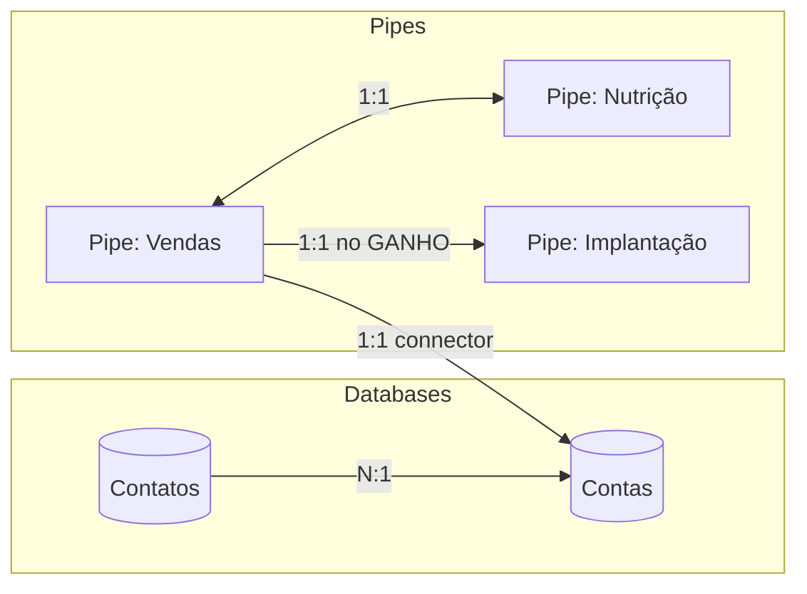

# Output Examples — Pipefy Setup

## Exemplo: Design do Pipe Vendas (trecho)

```markdown
# Design Pipefy — Nexuz Vendas

## Arquitetura Geral



## Pipe: Vendas

### Phases
| # | Nome | done? | Descrição |
|---|---|---|---|
| 1 | Novo Lead | false | Entrada por Inbound/Outbound/Indicação |
| 2 | Qualificação | false | Cadência de qualificação + Checklist Binário |
| 3 | Demo Agendada | false | Agendamento e execução da demo |
| 4 | Pós-demo | false | Registro de desfecho |
| 5 | Proposta | false | Envio e follow-up |
| 6 | Fechamento | false | CNPJ + boleto + contrato |
| 7 | GANHO | true | Terminal positivo |
| 8 | DESCARTE | true | Terminal negativo (motivo obrigatório) |

### Phase Fields: Qualificação
| Campo | Tipo | Required | Descrição |
|---|---|---|---|
| Fit confirmado | radio_vertical | true | ICP = QS ou FS |
| Faturamento declarado | currency | true | Faturamento mensal da empresa |
| Dor central identificada | long_text | true | Descrição da dor principal |
| Nº unidades | number | true | Quantidade de unidades |
| Decisor confirmado | short_text | true | Nome do decisor |
| Urgência declarada | long_text | true | Descrição da urgência |
```

## Exemplo: Log de Configuração (trecho)

```markdown
# Log de Configuração Pipefy

## Resumo
- Total de operações: 47
- Sucesso: 45
- Falha: 0
- Manual required: 2 (Dashboards)
- Skill usada: pipefy-integration v1.0.0

## IDs Criados
| Objeto | Nome | ID |
|---|---|---|
| Database | Contas | 301234567 |
| Database | Contatos | 301234568 |
| Pipe | Vendas | 302345678 |
| Phase | Novo Lead | 303456789 |
| Phase | Qualificação | 303456790 |
...

## Layer 1: Databases

### Database: Contas
- [✅] Criado em 2026-04-20T14:30:00Z via GraphQL — ID: 301234567
- Fields: CNPJ (cnpj, required), Razão Social (short_text, required), ...
```
